::: {.callout-warning}
## Discussion Draft

**Document version 1.0 · Public-review date 2026-08-07**

This analysis presents the complete declared scenario space before selecting a
principal review set. No candidate is preferred or adopted, and this document
does not change the rules enforced by deployed software.
:::

# Abstract {.unnumbered}

Rincoin targets one-minute blocks but inherited a 210,000-block binary-halving
interval. The resulting subsidy cuts occur roughly every five months rather than
roughly every four years, creating repeated 50% shocks to nominal miner revenue.
This report compares the unchanged rule with bounded and unbounded alternatives
for block height 840,000 using reproducible integer simulations, explicit policy
gates, a compact unweighted monetary score, and a separately reported empirical
security overlay.

The deterministic layer first defines scenarios S0 through S7 with variants and
calculates all bounded schedules with integer base-unit arithmetic. Eligibility
gates and five equally weighted criteria are then applied to every bounded
candidate. Numerical scoring is one input to the later review-set selection,
not an adoption decision or a complete measure of security.

Frozen chain, fee, market, and rental evidence is evaluated only after the
deterministic results and selection method. It tests current fee-replacement,
liquidity, rental, concentration, confirmation and implementation risks but
does not convert observations into a causal forecast. Every later candidate
conclusion remains conditional on source correction, arithmetic review,
implementation tests, chain-separation decisions, service readiness and
voluntary network adoption.

# Executive Summary {.unnumbered}

Rincoin targets a block every 60 seconds and reduces the deployed subsidy by
half every 210,000 blocks. A 210,000-block epoch therefore lasts about five
target months, making Rincoin's 50% reward shocks approximately ten times more
frequent in calendar time than the corresponding Bitcoin cadence.
The decision at block height 840,000 is whether to leave that rule unchanged or
replace it with a slower deterministic decline.

The Customized Halving work identified Rincoin's unusually frequent 50%
subsidy shocks as a problem requiring explicit review [@tokino2026regenerative]. 
That diagnosis does not imply automatic acceptance of its exact parameters, 
governance model or implementation choices introduced in the Tokino's study - 
they are included here as one of several bounded candidate scenarios.

The evaluation uses a transparent decision tree:

1. If no correction is desired, S0 remains the deployed baseline.
2. If correction is desired but bounded issuance is not required, S3 and S7
   remain policy comparators.
3. If both correction and bounded issuance are required, the bounded candidate
   set is S1, S2/a, S2/b, S4, S5/a, S5/b, S6/a, S6/b, and S6/c.

Five equally weighted monetary criteria compare the bounded candidates:
reward-path correction, monetary discipline, ten-year scheduled supply
expansion, nominal subsidy runway, and rule clarity and auditability. Rule
clarity evaluates each proposal as originally published. Reconstruction,
specification and vectors produced for this review do not retroactively improve
that source score. Monetary totals, fixed-phase duration, transition shocks and
the complete score table are presented before any principal set is selected.

For deterministic calculations, S6/a, S6/b and S6/c are fixed height-only
interpretations of the three study scenarios. The S6/b review rule derives a
finite 0.6 RIN phase ending at height 234,587,500 and exactly 168,000,000 RIN
maximum scheduled issuance. Underclaims do not extend the phase. The study's
governance contingency is discussed but is not inserted into that consensus
function. S7 remains the separate unbounded inspected code path.

The empirical overlay is deliberately separate from the monetary score. Frozen
chain data test current transaction fees, halving windows, rental exposure,
liquidity, operator concentration and confirmation assumptions. These data are
thin, partly operator-supplied and unsuitable for causal claims. They inform
later trade-off analysis without preselecting a monetary rule.

The document proceeds in dependency order: definitions and decision gates;
every scenario and source; deterministic methods and results; complete scoring;
transparent review-set selection; controlled and representative comparisons;
empirical security evidence; implementation risks; and conclusions. No
candidate is adopted or preferred in this front matter.

\newpage
\tableofcontents
\newpage

# Introduction

This report compares deterministic monetary schedules that can apply at and
after block height 840,000. It separates historical documentation, deployed
consensus, reproducible simulation, observed evidence, policy criteria, and
implementation risk. It is not itself a consensus specification or a network
decision.

The Customized Halving work identified Rincoin's unusually frequent 50%
subsidy shocks as a problem requiring explicit review [@tokino2026regenerative]. 
The study also identified a contradiction between the original whitepaper's 168,000,000 RIN maximum-supply statement and the deployed binary-halving schedule, which approaches approximately 21 million RIN before integer-rounding effects. 
While this does not imply automatic acceptance of its exact parameters,
governance model or implementation choices introduced in the Tokino's study,
its contribution to these findings is recognized and the scenarios proposed by
the study are included in the candidate scenarios this analysis compares.

The comparison asks:

- Does the current 210,000-block binary-halving cadence require correction?
- Is bounded issuance a required policy property?
- What maximum issuance, near-term supply expansion, subsidy runway, and
  activation shock follow from each complete rule?
- Which conclusions are deterministic, observed, derived, or assumption-based?
- What evidence or implementation finding should change the later review-set selection?

\newpage
# Starting Points and Initial Assumptions

## Document Hierarchy

| Layer | Role |
|---|---|
| Rincoin whitepaper | Compact statement of Rincoin identity, consensus design and monetary rule |
| **Scenario analysis** | **Evidence status, scenarios, simulations, economic reasoning, risk register and unresolved decisions (this document)** |
| Consensus-change specification | Normative formulas, activation rules, integer arithmetic, block validation rules and test vectors |
| Rincoin Community Core implementation and tests | Executable consensus behaviour and release artifacts |

## Source Hierarchy

Claims use four evidence categories:

1. **Original-whitepaper claims** establish what the historical RinCoin document stated.
2. **Deployed source-code facts** establish current consensus behaviour as enforced by validating software.
3. **Chain-data and simulation-derived results** establish observed history, calculated supply paths and projected consequences under explicit assumptions.
4. **Policy/design recommendations** state proposed future choices for public review.

The original whitepaper confirms at the documentation level: BLAKE3 -> Argon2d
-> SHA3-256, a 60-second target block interval, a 50 RIN initial subsidy, a
stated maximum supply of 168,000,000 RIN, Dark Gravity Wave v3, no premine, no
developer tax, CPU/GPU accessibility as a design claim, and ASIC resistance as
a design claim [@rincoinWhitepaper2025]. 

The deployed binary-halving schedule confirms all whitepaper claims except the 168,000,000 RIN maximum-supply statement. The deployed
code does not implement the stated 168 million figure; before integer-rounding
effects it approaches approximately 21 million RIN
[@rincoinCore2026chainparams; @rincoinCore2026subsidy]. This is an objective
documentation-versus-consensus inconsistency. The scenarios below test
different policy responses to that inconsistency.

The deployed source code defines actual consensus behaviour that has been already established. Therefore, a documentation claim must not be converted into a 
deployed-consensus fact without a proper reconsideration.

## Scope Boundary: Proof of Rinne

Tokino's broader paper presents **Proof of Rinne (PoR)** as a long-horizon
research architecture in which a separate temporal layer would eventually
recirculate assets considered irretrievably lost or abandoned, while attempting
to preserve a fixed macro-level supply bound and a continuing miner-security
budget [@tokino2026regenerative].

The idea is relevant to long-term research and should not be dismissed merely because it is incomplete. It addresses a real question: whether a capped proof-of-work currency can maintain incentives after ordinary issuance becomes negligible without adopting perpetual inflation. However, PoR is not evaluated as one of the present Layer-1 monetary scenarios because it depends on mechanisms that are outside the block-840,000 decision and are not yet specified at implementation level. In particular, the present materials do not provide a consensus-safe method to prove permanent abandonment rather than long-term inactivity, a complete ownership-recovery and adversarial threat model, deployed reference code, normative test vectors, or a near-term activation path.

Chapter 3 of Tokino v1.6.4 remains relevant here because it defines concrete Layer-1 Customized Halving schedules that can be simulated. The later PoR architecture is therefore acknowledged but excluded from scoring by scope, not rejected as an idea, but not treated as current Rincoin consensus.

## Tail Emission Legitimacy

This analysis does not accept the 1.5% annual retention-loss assumption used in
Tokino's study as a sufficient basis for introducing perpetual tail emission.
The parameter is a model-calibration assumption rather than an independently
validated empirical constant.

Available Bitcoin loss estimates either measure narrowly defined provably lost
supply or infer a much broader probably lost supply through heuristics. They
vary substantially by methodology and do not establish a stable, memoryless
annual loss rate. Some more recent estimates are more consistent with losses
having been concentrated disproportionately in Bitcoin's early years than with
a constant annual hazard. Loss rates may also decline as asset values, custody
technology, backup practices, and user awareness improve, although the true
loss process cannot be observed directly from blockchain inactivity alone.

This does not imply that tail emission should be rejected permanently. Every
bounded non-S0 scenario covered by this analysis keeps the block subsidy above
0.5 RIN for more than ten target years and non-zero for more than a century.
This provides substantial time for future maintainers and the community to
evaluate improved estimates of coin loss, fee revenue, hashrate, mining
economics, and observed security conditions.

If later evidence shows that a permanent subsidy is necessary, the monetary
rules could be amended through a future explicit consensus change before the
scheduled subsidy reaches zero. Introducing perpetual issuance now would
therefore commit the protocol to an unbounded monetary path on the basis of a
weakly supported assumption.

Postponing that decision preserves optionality and does not require the project
to resolve today a zero-subsidy security question that lies far outside the
current planning horizon. Conversely, an unnecessary perpetual emission, once
embedded in expectations and mining economics, may be substantially harder to
remove.

## Continuity Concepts

For purpose of this analysis, three distinct continuity concepts are defined:

**Ledger continuity** means preservation of existing blockchain history and UTXO 
state. This is a non-negotiable condition - all valid pre-activation blocks, balances 
and ownership claims must remain valid for every scenario examined.

**Consensus-code continuity** means preservation of current validation rules without 
change. Any post-840,000 subsidy change is a hard fork and therefore does not preserve 
consensus-code continuity after activation, so no scenario can claim that property
except the unchanged baseline scenario where no consensus rules change.

**Monetary-intent continuity** means alignment with an explicitly stated
interpretation of the original whitepaper's monetary intent. Because the
original whitepaper's documented 168,000,000 RIN maximum-supply statement
conflicts with the deployed binary-halving schedule, no interpretation is
neutral: this analysis compares treating that statement as a historical upper
bound, a policy target, or a comparison reference. A historical documentation
error is one possible interpretation, but the available evidence does not
establish which parameter was erroneous. Therefore, this analysis compares 
the scenarios to both the original whitepaper's 168,000,000 RIN statement and 
the deployed binary-halving schedule. It also recognizes that the finite issuance 
has been an intention of both the original whitepaper and the deployed code, even 
if the exact upper bound is disputed.

## Deterministic Supply Accounting

Consensus monetary rules evaluated in this report are deterministic functions of block height:

$$
B_{\max}(h)=f(h),
$$

where $B_{\max}(h)$ is the maximum permitted block subsidy at height $h$.

They must not depend on actual minted coinbase outputs, circulating supply, spendable supply, UTXO supply, underclaimed subsidy or transaction fees. Underclaimed subsidy is not reissued. Transaction fees do not count as newly issued supply.

The analysis distinguishes:

- **original 168,000,000 RIN statement**: a maximum-supply statement in the original whitepaper that conflicts with deployed binary-halving consensus;
- **effective maximum scheduled issuance**: the maximum amount a deterministic subsidy schedule can issue;
- **final spendable or circulating supply**: an economic or chain-observation quantity that may be lower than scheduled issuance.

## RinHash and Difficulty Source Note

The deployed source references identify the RinHash construction and Argon2d
parameters [@rincoinCore2026rinhash] and the DGWv3 implementation and selection
[@rincoinCore2026dgw].

RinHash is memory-hard and was designed to increase the cost of fixed-function specialization relative to simple hash-only proof-of-work algorithms. ASIC resistance and CPU/GPU accessibility are design goals and threat-model statements, not permanent empirical guarantees.

The currently deployed Core implementation has been verified as using Argon2d
v1.3 with time cost `t_cost = 2`, memory cost `m_cost = 64` KiB / 64
one-kilobyte blocks, and `lanes = 1` [@rincoinCore2026rinhash]. These parameters
are not changed by any monetary schedule evaluated here. Current settings
remain light enough that commercially available FPGA implementation might be
plausible. 

While this analysis recognizes that the RinHash design is a deliberate 
attempt to reduce the cost advantage of fixed-function specialization, it does not 
evaluate the security of RinHash or its resistance to future ASIC development. The 
analysis assumes that the current proof-of-work function remains unchanged for all 
scenarios, and any future changes to RinHash would require a separate consensus 
proposal, review, and testing process.

\newpage
# Evaluation Criteria

A monetary-policy comparison should not allow a scenario to win merely because it avoids change, nor should it reward the same property several times under different names. 

Therefore, the analysis separates **eligibility checks** from **five scored criteria**. The checks identify scenarios that do not satisfy a declared policy requirement. The scores then compare the remaining trade-offs without hidden weights.

## Eligibility Checks

| Check | Pass condition | Consequence |
|---|---|---|
| Deterministic consensus rule | Subsidy is fully defined by block height and fixed integer constants. | A scenario that fails is not implementation-ready and is excluded from candidate scoring. |
| Corrective relevance | The rule materially addresses the repeated 50% subsidy cuts produced by 210,000-block epochs at a 60-second block interval. | S0 remains the indispensable baseline, but it is not scored as a corrective candidate once the rapid-halving problem statement is accepted. |
| Bounded issuance | Maximum scheduled issuance is finite and predetermined. | S3 and S7 remain useful security-economics comparators, but they are excluded from candidate scoring under the fixed-supply requirement. |

The first check is technical. The latter two are explicit policy gates adopted for this comparison. Raw deterministic results remain available for every scenario, including the excluded baselines and comparators, but only scenarios passing all three checks enter the candidate score table.

## Scored Criteria

Scores use a 0-4 scale:

- **4 points**: strong fit with the criterion;
- **3 points**: good fit with a clear trade-off;
- **2 points**: mixed result;
- **1 point**: weak fit;
- **0 points**: fails the criterion.

\blandscape
\scriptsize

| Criterion | Question asked | Scoring rule |
|---|---|---|
| Reward-path correction | How well does the rule correct the rapid 50% | 4 = recurring reductions are no greater than 10%; |
|                        | reduction cadence caused by 210,000-block    | 3 = 50% reductions remain but are spaced roughly four years apart; |
|                        | epochs at a 60-second block interval?        | 2 = several manual 50% steps remain within the first 15 years; |
|                        |                                              | 1 = only limited mitigation; |
|                        |                                              | 0 = unchanged 50% reductions every 210,000 blocks. |
| | | |
| Monetary discipline    | Is issuance finite and scarce without being  | 4 = finite, no constant phase, and final issuance no more than one third of 168M; |
|                        | dominated by a cap-filling constant phase?   | 3 = finite, no dominant constant phase, and final issuance between one and two thirds of 168M; |
|                        |                                              | 2 = finite above two thirds of 168M without a dominant constant phase; |
|                        |                                              | 1 = finite, but more than half of final issuance occurs in a constant phase; |
|                        |                                              | 0 = unbounded. |
| | | |
| Ten-year scheduled     | How much new issuance is scheduled during    | 4 = no more than 25%; |
| supply expansion       | the first ten years after activation,        | 3 = more than 25% and no more than 60%; |
|                        | relative to the 19,687,500 RIN scheduled     | 2 = more than 60% and no more than 100%; |
|                        | before height 840,000?                       | 1 = more than 100% and no more than 150%; |
|                        |                                              | 0 = more than 150%. |
| | | |
| Nominal subsidy runway | How long does the maximum block subsidy      | 4 = at least 25 years or indefinitely; |
|                        | remain at or above 1 RIN?                    | 3 = 10 to less than 25 years; |
|                        |                                              | 2 = 5 to less than 10 years; |
|                        |                                              | 1 = 2 to less than 5 years; |
|                        |                                              | 0 = less than 2 years. This is only a nominal runway proxy, not a complete security-budget model. |
| | | |
| Rule clarity and auditability | Can the full schedule be explained and  | 4 = one familiar formula or parameter change, with no special terminal phase; |
|                        | independently reproduced without hidden state  | 3 = one formula plus one floor or tail, or one unusual coefficient requiring derivation; |
|                        | or many exceptions?                          | 2 = several fixed phases, or one formula plus a special terminal height; |
|                        |                                              | 1 = several phases plus a cap-filling terminal boundary; |
|                        |                                              | 0 = state-dependent or incompletely specified. |
: {tbl-colwidths="[19, 31, 50]"}

\normalsize
\elandscape

The five scores deliberately cover different questions: the problem being
corrected, the monetary result, scheduled supply expansion, the nominal mining
runway, and the clarity of the consensus rule. Scheduled supply expansion is a
deterministic measure; actual economic dilution also depends on active supply,
lost coins, market demand, price, and liquidity. The scores are not a substitute
for price, hashrate, fee-market, or miner-cost analysis.

**Rule clarity and auditability evaluates the proposal as originally
published, including the precision of its rule, the derivation of its
parameters, and unresolved governance or terminal behavior. Later
reconstruction, specification, vector generation, or implementation work
prepared for this review does not retroactively increase the source proposal's
score.** This rule applies equally to every externally sourced scenario.

The arithmetic total is a compact balance indicator only. It must be read together with the eligibility checks and the underlying deterministic values.

\newpage
# Scenario Definitions

In this chapter, the scenarios are defined and the rationale for each is explained. 
The scenarios are numbered S0 through S7, with variants where appropriate. Each 
scenario is described in terms of its subsidy rule, its expected behavior, and its 
relevance to the overall analysis.

Unless stated otherwise, scenarios use $1 \text{ RIN} = {10}^{8} = 100{,}000{,}000$ 
base units, preserve all blocks below height 840,000, and define alternatives from the 
block height 840,000 (or fifth reward epoch the way epochs are defined by the current 
consensus rules) onward. In this document, "post-840k" means block height 840,000 and 
later.

The descriptions below define the rules and explains why each case is included. They 
do not select a winner. Comparative advantages and disadvantages are assessed after 
the generated results.

## Overview of Scenario Strategies and Objectives

The alternative scenarios examined in this analysis explore three related issues:

- **Rapid subsidy decline** — under the deployed schedule, the block subsidy
  is halved every 210,000 blocks, or approximately every five target months.
  This both large or unusually frequent.

- **The 21M/168M documentation–consensus inconsistency** — the original
  whitepaper documents an issuance figure of 168 million RIN, while the
  deployed consensus rules imply maximum scheduled issuance of approximately
  21 million RIN.

- **The long-term mining security budget** — under a finite subsidy schedule,
  the block subsidy eventually reaches zero, leaving transaction fees as the
  only remaining block-reward component. It is uncertain whether fee revenue
  alone would provide a sufficient long-term incentive to secure the network.

These issues are interdependent. A rule that addresses one of them may improve
or worsen another. The scenario set is therefore designed to expose the
trade-offs among subsidy cadence, total scheduled issuance, and the long-term
subsidy path.

The classifications below are independent of one another. Each alternative
scenario belongs to one category under each issue: its subsidy-reduction
strategy, its treatment of the documented 168 million RIN figure, and its
terminal-subsidy behaviour.

*Note: S0 is the deployed baseline and is therefore not classified under the three issues.*

### Subsidy-reduction strategy

For the first issue, the scenarios use three principal approaches:

- **Reduction-factor scenarios (S1, S2/a, S2/b, S3, S4)** — these scenarios
  retain the existing epoch length but replace the 50% reduction with a
  different multiplicative factor applied at each epoch boundary.

- **Extended-epoch scenarios (S5/a, S5/b)** — these scenarios retain 50%
  subsidy-reduction steps but increase the interval between later reductions.

- **Customized Halving[^1] scenarios and the related implementation path
  (S6/a, S6/b, S6/c, S7)** — these scenarios use manually specified,
  piecewise-defined block-height boundaries and subsidy levels. S6/a, S6/b,
  and S6/c are study scenarios, while S7 represents the separately inspected
  implementation path derived from the same broader design direction.

[^1]: The term "Customized Halving" is used in Tokino's study to describe
    scenarios based on manually specified, piecewise subsidy schedules.
    Although these schedules do not always involve literal halving, this
    analysis retains the term for consistency with the source material.

### Treatment of the documented 168 million RIN figure

For the second issue, the scenarios fall into three groups according to their
maximum scheduled issuance:

- **Below 168 million RIN (S1, S2/a, S2/b, S5/a, S5/b)** — these scenarios
  treat 168 million RIN as an upper bound rather than a target that must be
  reached. They increase maximum scheduled issuance relative to S0 but remain
  below the documented figure.

- **Exactly 168 million RIN (S4, S6/a, S6/b, S6/c)** — these scenarios treat
  168 million RIN as a terminal maximum-scheduled-issuance target.

- **Unbounded issuance (S3, S7)** — these scenarios do not enforce
  168 million RIN as a finite Layer-1 cap. Their scheduled issuance eventually
  exceeds that figure and continues without a finite terminal maximum.

### Terminal-subsidy behaviour

For the third issue, the scenarios use three approaches:

- **Continued decline to zero without a fixed terminal phase
  (S1, S4, S5/a, S5/b)** — these scenarios continue reducing the subsidy until
  it reaches zero under the applicable integer-arithmetic rule. They do not
  provide a perpetual subsidy.

- **Finite fixed-subsidy phase (S2/a, S2/b, S6/a, S6/b, S6/c)** — at a defined
  height, these scenarios switch to a constant subsidy that remains in effect
  until the scenario's terminal issuance limit is reached. This fixed phase
  may be substantially longer than the preceding declining phase and, in some
  cases, may last for centuries.

- **Perpetual fixed subsidy (S3, S7)** — at a defined height, these scenarios
  switch to a constant non-zero subsidy that continues indefinitely. Their
  maximum scheduled issuance is therefore unbounded.

### Scenario Strategies Summary

| Scenario | Subsidy strategy | 168M treatment | Terminal behaviour |
|:--|:--|:--|:--|
| **S0** | None (baseline) | Below 168M | Declines to zero |
| **S1** | Reduction factor | Below 168M | Declines to zero |
| **S2/a** | Reduction factor | Below 168M | Finite fixed phase |
| **S2/b** | Reduction factor | Below 168M | Finite fixed phase |
| **S3** | Reduction factor | No finite cap | Perpetual fixed subsidy |
| **S4** | Reduction factor | Exact 168M target | Declines to zero |
| **S5/a** | Extended epochs | Below 168M | Declines to zero |
| **S5/b** | Extended epochs | Below 168M | Declines to zero |
| **S6/a** | Customized path | Exact 168M target | Finite fixed phase |
| **S6/b** | Customized path | Exact 168M target | Finite fixed phase |
| **S6/c** | Customized path | Exact 168M target | Finite fixed phase |
| **S7** | Customized path | No finite cap | Perpetual fixed subsidy |

: Summary of scenario strategies and their treatment of the three principal issues. {#tbl-scenario-strategy-overview}
: {tbl-colwidths="[16, 28, 28, 28]"}

## S0 - Unchanged Binary Halving

Scenario S0 is the baseline for all other scenarios because it follows the subsidy rule that has governed the chain since genesis.

The deployed binary-halving logic continues unchanged. Half of the subsidy is subtracted every 210,000 blocks until integer right-shift rounding reaches zero. In base units, the rule for epoch $e$ is:

$$
\qquad b_1=5{,}000{,}000{,}000=50 \text{ RIN}\newline
\qquad b_{e}=\left\lfloor\left(1-\frac{1}{2}\right)b_{e-1}\right\rfloor, \qquad e=2,3,4\ldots
$$

S0 requires no post-840k consensus change. It is included to show the deployed-code baseline against which all hard-fork alternatives must justify their additional issuance and implementation risk.

## S1 - One-Twentieth Reduction Without a Floor

Beginning at block height 840,000, subsidy follows a recursive 19/20 rule per
210,000-block epoch instead of binary halving. This is nominally a 5% reduction,
with integer-floor rounding after each epoch; effective percentage reductions
can differ slightly after rounding.

The one twentieth in S1 is chosen as a reduction factor ten times smaller than the original one half, matching the fact that Rincoin's target block interval is ten times shorter than Bitcoin's. The relationship is approximate rather than exact: after 10 epochs, the subsidy factor is $(1-\frac{1}{20})^{10}\approx0.5987$, not $0.5$.

S1 is the first from the reduction-factor scenarios, proposing a direct way to slow down the fast subsidy decline caused by 60-second blocks while retaining a simple geometric rule by changing the factor used for the new subsidy calculation only. It preserves deterministic height-only accounting based on geometric function, uses the same epoch length and avoids dynamic supply tracking.

There is no fixed floor and no constant terminal phase in S1. Integer base-unit rounding eventually brings subsidy to zero. In base units, the post-840k rule is:

$$
\qquad b_4=625{,}000{,}000\newline
\qquad b_{e}=\left\lfloor\left(1-\frac{1}{20}\right)b_{e-1}\right\rfloor, \qquad e=5,6,7\ldots
$$

The first post-840k subsidy for the fifth epoch is 5.93750000 RIN.

## S2 - One-Twentieth Reduction With Finite Constant-Phase Variants

S2 variants apply the S1 one-twentieth reduction until the next calculated subsidy would fall below a selected fixed phase amount. They then use that fixed subsidy for a predetermined number of blocks and stop before exceeding the 168,000,000 RIN ceiling.

These variants test the policy choice of using most of the historical 168 million upper bound while keeping Layer-1 issuance finite and height-deterministic. They also expose how long a constant phase must last when it is used to approach that ceiling.

### S2/a - Finite 0.5 RIN Phase

S2/a uses one-twentieth reductions until the next epoch subsidy would fall below 0.5 RIN. It then uses 0.5 RIN for a finite predetermined block range and terminates.

### S2/b - Finite 1 RIN Phase

S2/b uses one-twentieth reductions until the next epoch subsidy would fall below 1 RIN. It then uses 1 RIN for a finite predetermined block range and terminates.

## S3 - Perpetual 0.5 RIN Tail-Emission

S3 applies the S1 one-twentieth reduction until 0.5 RIN and then keeps a perpetual 0.5 RIN subsidy, even after the 168,000,000 RIN ceiling is reached. The perpetual phase is a tail-emission design choice that can be argued as a direct miner-security-budget mechanism. It is included to show the effect of a permanent nominal subsidy on scheduled issuance and to provide a comparator for bounded schedules.

This scenario isolates the explicit-tail-emission design choice. It is included because a permanent nominal subsidy can be argued as a direct miner-security-budget mechanism, but it must be compared separately from finite schedules.

## S4 - Idealized 113/114 Cap-Derived Geometric Schedule

S4 uses an epoch coefficient of 113/114 and has no fixed subsidy phase. The coefficient has been defined as mathematically closest to the original whitepaper's declared 168,000,000 RIN maximum when applied as a geometric post-840k rule under integer base-unit arithmetic.

This scenario is a cap-derived comparator. It tests a smooth geometric approach to the historical upper bound without selecting a fixed terminal subsidy.

## S5 - Extended-Epoch Binary-Halving Variants

S5 tries a different approach to slowing the rapid 50% reductions. It retains the original binary-halving rule but lengthens the epoch from 210,000 blocks ten times 
to 2,100,000 blocks to match the bitcoin halving interval.

Both S5 variants retain original binary integer halving, nominally a 50% reduction with
floor rounding at base-unit precision. At a 60-second target interval, each long epoch lasts approximately four target years. The variants differ only in the boundary used
as the phase anchor for post-activation calculations.

Both variants are deterministic, have no fixed terminal phase, and eventually
reach zero through binary integer rounding. 

### S5/a - Long Epoch Anchored at Height 840,000

S5/a starts the first 2,100,000-block epoch at height 840,000. The subsidy
therefore falls from 6.25 RIN at height 839,999 to 3.125 RIN at height 840,000.
The next halving occurs at height 2,940,000.

S5/a keeps the immediate 50% miner-revenue shock at activation.

### S5/b - Long Epoch Phase-Aligned to Height 630,000

For block heights at and above 840,000, the extended-epoch schedule is
phase-aligned to height 630,000, the beginning of the existing 6.25 RIN subsidy
period. 

No block or validation rule below height 840,000 is changed. At this activation 
height, 210,000 blocks have elapsed since the phase anchor, so the
subsidy remains 6.25000000 RIN through height 2,729,999. The first later
halving is at height 2,730,000, approximately 3.60 target years after
activation. 

S5/b has no immediate miner-revenue shock but retains 50% reductions at later 
long-epoch boundaries.

## S6 - Customized Halving Study Scenarios

S6 variants model the three Customized Halving scenarios in chapter 3 of
Tokino's Rincoin v1.6.4 study. Tokino offers three possible scenarios I, II and III, which are included here as S6/a, S6/b, and S6/c [@tokino2026regenerative].

Tokino's broader study combines deterministic block rewards with annual
loss-rate assumptions, effective-circulating-supply modeling, a
governance-controlled contingency that may switch Scenario II to Scenario III,
and a view of subsidy design as subject to continuing governance control. This
analysis retains those ideas as policy context but does not insert them into a
fixed consensus function. The study does not specify a complete consensus
authorization mechanism, deterministic trigger, or activation method for the
contingency. Including it would prevent a fixed height-only comparison.

### S6/a - Customized Halving Study Scenario I

S6/a follows the PDF's Scenario I reward path: 4 RIN from height 840,000, 2 RIN from 2,100,000, 1 RIN from 4,200,000, and a finite 0.5 RIN phase from 6,300,000 until the simulated 168,000,000 RIN ceiling is reached.

### S6/b - Customized Halving Study Scenario II

S6/b follows the PDF's Scenario II reward path: 4 RIN from height 840,000,
2 RIN from 2,100,000, 1 RIN from 4,200,000, and 0.6 RIN from height
6,300,000. For this bounded review interpretation, the final phase ends at the
precomputed height needed to reach exactly 168,000,000 RIN maximum scheduled
issuance: height 234,587,499 is the final non-zero block and height 234,587,500
is the first zero-subsidy block. This cutoff is provisional pending
clarification from the study's author. Underclaims are not reissued and do not
extend the phase.

### S6/c - Customized Halving Study Scenario III

S6/c follows the PDF's Scenario III reward path: 4 RIN from height 840,000, 2 RIN from 2,100,000, 1 RIN from 4,200,000, an additional 1 RIN phase from 6,300,000, and a finite 0.6 RIN phase from 8,400,000 until the simulated 168,000,000 RIN ceiling is reached.

## S7 - Aevust Core Customized Halving Tail-Emission Implementation

S7 models the inspected Aevust Core subsidy implementation snapshot as a
separate source artifact. Its phase rewards correspond to Tokino Scenario II
through height 6,300,000: 4 RIN from height 840,000, 2 RIN from 2,100,000,
1 RIN from 4,200,000, and 0.6 RIN from 6,300,000
[@aevustCore2026customized].

The difference from S6/b is termination. S6/b is the review's bounded
height-only reconstruction of the published study direction. S7 models the
available Core code path as inspected: no finite terminal height is visible in
the subsidy function, so the 0.6 RIN phase behaves as tail emission unless
another consensus rule elsewhere enforces a cap. The deterministic S6 study
scenarios and the S7 code snapshot are separate artifacts and are not blended
into a synthetic rule.

\newpage
\blandscape
# Deterministic Simulation Results

Generated artifacts use `data/scenario_config.json` as the machine-readable source of truth and `scripts/simulate_monetary_scenarios.py` as the generator. The year convention is 365 days and 525,600 target blocks per year. All consensus-deterministic quantities are integer base-unit outputs.

## Scenario Summary



The summary shows several distinct design families. S0 is the unchanged
deployed baseline. S1 and both S5 variants are finite schedules without a
constant phase. S1 changes the reduction coefficient; S5/a and S5/b retain
binary halving but use different phase anchors for post-activation
2,100,000-block epochs. S2 uses
finite constant phases to approach the historical 168 million upper bound. S3
is a perpetual-tail comparator. S4 approaches the same upper bound through a
shallow geometric coefficient. S6 contains Tokino's finite Customized Halving
study scenarios. S7 models the inspected Aevust Core implementation snapshot
as an unbounded 0.6 RIN tail-emission variant.

The scenarios deliberately exercise different policy directions: deployed-code continuity, one-twentieth reduction, fixed-phase cap use, perpetual tail emission, cap-derived geometric decline, longer halving epochs, Tokino's study scenarios and Aevust's implementation snapshot. The deterministic tables show the cost of each direction in scheduled issuance, constant-phase duration, terminal height and near-term dilution.

\newpage
## Constant-Phase Results



The finite constant-phase scenarios are bounded, but the bound is reached only after very long durations. Duration of fixed phase of every assessed scenario substantially exceeds human life-span. It is also worth noting that the majority of the issuance is concentrated in the constant phase. Lowering the fixed phase from 1 RIN to 0.5 RIN lowers annual issuance but lengthens the phase when the goal is still to approach the 168 million ceiling. The scenarios have shorter or longer fixed phases depending on where the phase begins and which fixed reward is used.

\newpage
## Scarcity and Dilution Comparison



For unbounded schedules, 500-year issuance is shown as a measurement horizon, not as a cap. The near-term columns are decision-relevant because the first 1, 10 and 25 years define the immediate dilution trade-off visible to holders and miners.

\newpage
## Subsidy Thresholds

The following table summarizes the subsidy thresholds for each scenario, i.e. the block heights (and estimated time from the activation height in years) at which the maximum permitted subsidy falls below 1 RIN, 0.5 RIN, and 0.1 RIN. The table also shows the final non-zero subsidy height for finite schedules and the final non-zero subsidy value for unbounded schedules.



Threshold crossings expose both cliff risk and tail length. S0 falls below
small nominal subsidies fastest. S1 has no fixed phase, but it still has a long
declining geometric tail. S2 and S6 fixed-phase variants remain at or above
their fixed subsidy until the terminal height. S3 and S7 remain non-zero
indefinitely within the modelled horizon. S4 remains non-zero for the longest
finite period. Both S5 variants retain the halving pattern; S5/b remains at each
threshold longer than S5/a because its post-activation calculation is
phase-aligned 210,000 blocks before activation.

\newpage
## Representative Horizon Outputs



The complete horizon table for all scenarios is generated at `data/horizon_table.csv`.

\elandscape
\newpage
# Interpretation, Scoring, and Review-Set Selection

  *Note: because S1, S2 and S3 have exactly the same progress in the first ~14 years, their graphs overlap for those three scenarios in the given period and is visible as S3. The same is true for the S6 and S7 in first ~10 years (visible as S7).*

## Monetary Figures

The 500-year figures are structural comparisons. Unbounded scenarios are truncated at the 500-year plot horizon.

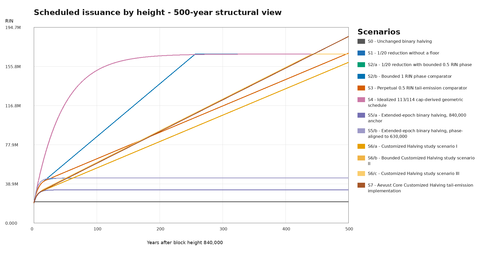

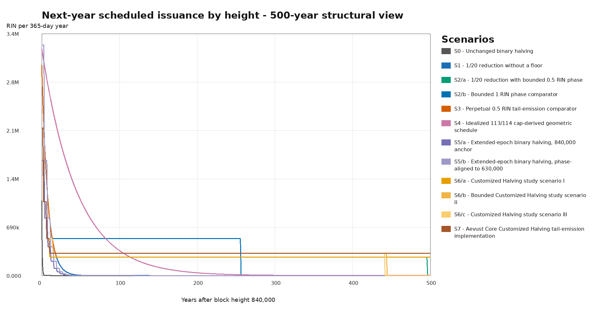

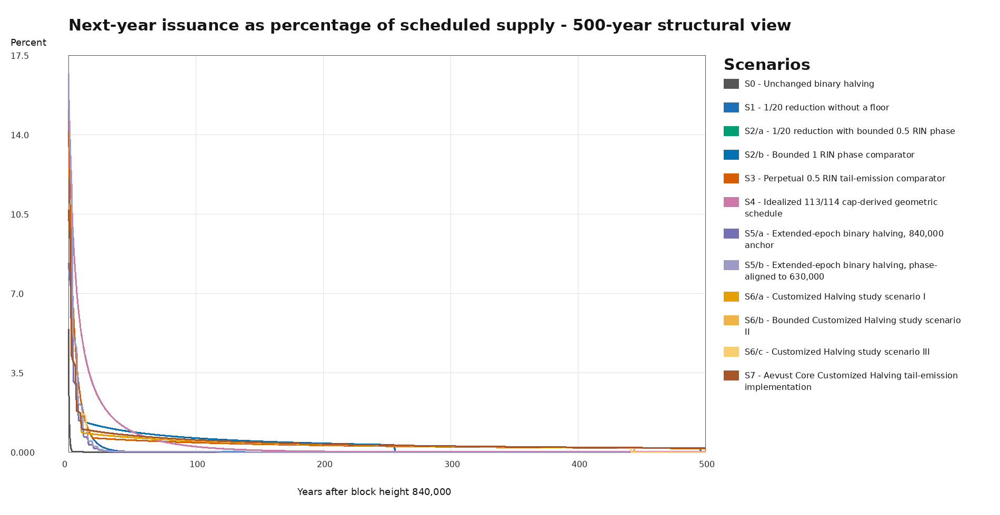

Near-term figures show differences that are visually compressed in the 500-year view.

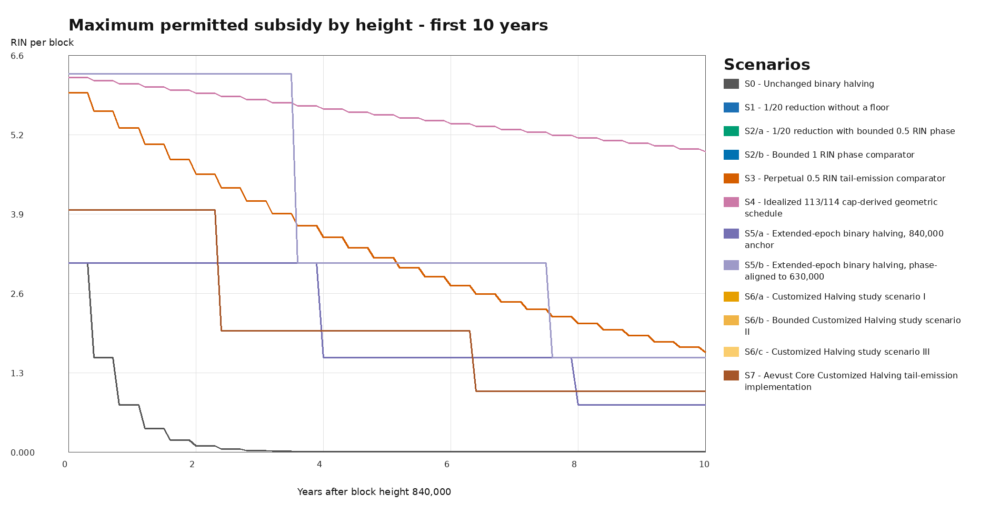

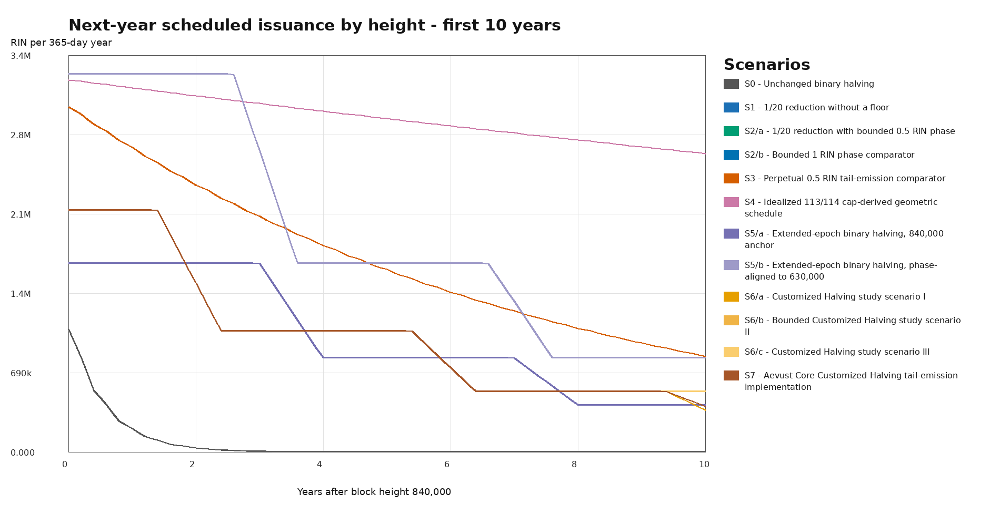

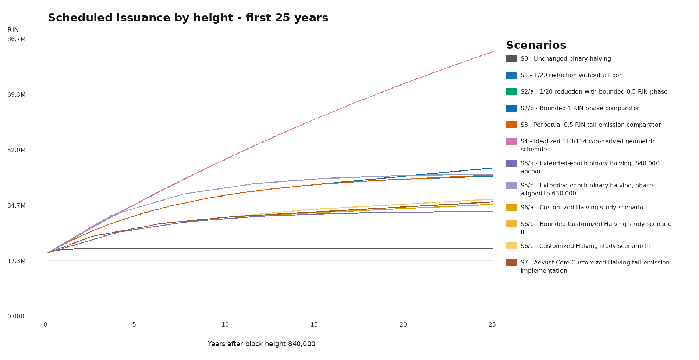

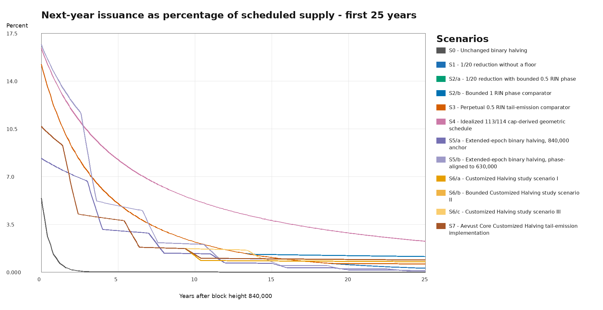

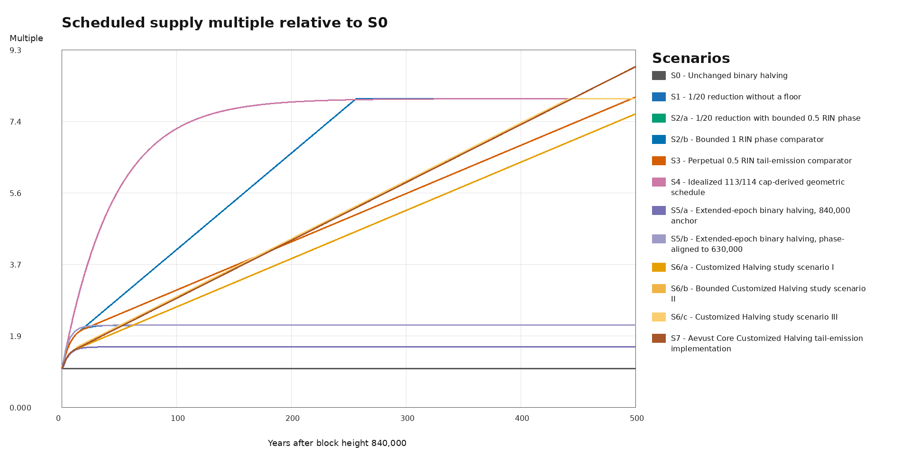

## Comparative Evaluation

The deterministic results reveal four broad outcomes.

- **S0** minimizes issuance and implementation change, but it leaves the five-month binary-halving cadence unchanged. It is therefore the baseline against which a correction must be justified, not automatically the best corrective policy.
- **S1 and the two S5 variants** are finite schedules without a constant phase.
  S1 replaces every 50% cliff with a 5% reduction and preserves subsidy above
  1 RIN for about 14 years. S5 variants keep the halving reduction but prolong 
  epochs ten times. S5/a has the lowest ten-year and final issuance of
  the three, but cuts subsidy by 50% at activation. S5/b has no immediate
  miner-revenue shock and remains above 1 RIN for about 11.59 years, but
  schedules more supply in the first ten years than S1 and retains delayed 50%
  cuts.
- **S4** provides the smoothest declining path and a long nominal runway, but it schedules almost the full historical 168M amount, creates about 149% additional issuance relative to activation supply within ten years, and continues for roughly 730 years. The 113/114 coefficient is mathematically auditable but less intuitive to explain than one twentieth or a conventional halving interval.
- **S2 and S6** are finite, but their constant phases create most of their final issuance and last for centuries. 
- **S3 and S7** preserve a permanent nominal subsidy at the cost of unbounded Layer-1 issuance.

The original whitepaper's documented 168,000,000 RIN maximum-supply statement
is not scored as a separate virtue. Treating it as a strict target, a maximum
ceiling, or a historical parameter inconsistency is a policy interpretation
that should be stated openly and discussed before it is used to justify any 
particular scenario.

\newpage
\blandscape

| Scenario | Main strength | Main weakness or trade-off |
|:---:|---|---|
| S0 | Lowest issuance, no hard fork, simplest continuation | Does not correct the rapid 50% reduction cadence; subsidy falls below 1 RIN in less than one year |
| S1 | Gradual 5% epoch reductions; finite 44.625M maximum; no fixed phase | Frequent monetary changes, weak major-halving salience, very low to none subsidy over a decades-long horizon |
| S2/a | Smooth early decline and finite issuance | About 75% of final issuance occurs in a roughly 477-year 0.5 RIN phase |
| S2/b | Long nominal runway and finite issuance | About 76% of final issuance occurs in a roughly 243-year 1 RIN phase |
| S3 | Simple permanent nominal subsidy | Unbounded supply |
| S4 | Very smooth decline and long nominal runway | Near-168M issuance, high near-term dilution, 113/114 explanation burden and roughly 730 years to zero |
| S5/a | Simple rule, 32.8125M maximum, lower ten-year scheduled supply expansion than S1 | Immediate 50% activation cut and subsidy below 1 RIN after about 7.99 years, very low to none subsidy over a decades-long horizon |
| S5/b | No immediate miner-revenue shock; familiar four-year rhythm; 44.625M maximum similar to S1 | About 103% ten-year scheduled expansion and first later 50% cut after about 3.60 years, very low to none subsidy over a decades-long horizon |
| S6/a | Finite implementation of the published 0.5 RIN study path | Multiple phases and a roughly 521-year cap-filling constant phase |
| S6/b | Finite implementation of the published 0.6 RIN study path | Multiple phases and a roughly 434-year cap-filling constant phase |
| S6/c | Longer 1 RIN phase before the final 0.6 RIN phase | Multiple phases and a roughly 428-year cap-filling constant phase |
| S7 | Long-lived nominal subsidy in inspected Core code | Unbounded issuance and several manually selected phase boundaries |
: {tbl-colwidths="[10, 43, 47]"}

## Eligibility Checks

The scenarios were evaluated against these checks to determine their eligibility for scoring.

| Scenario | Deterministic rule | Corrective relevance | Bounded issuance | Scoring status |
|:---:|:---:|:---:|:---:|---|
| S0 | \evalfull{} Satisfied | \evalfail{} Baseline outside corrective candidate set | \evalfull{} Satisfied | \evalfail{} Baseline outside corrective candidate set |
| S1 | \evalfull{} Satisfied | \evalfull{} Satisfied | \evalfull{} Satisfied | \evalfull{} Eligible |
| S2/a | \evalfull{} Satisfied | \evalfull{} Satisfied | \evalfull{} Satisfied | \evalfull{} Eligible |
| S2/b | \evalfull{} Satisfied | \evalfull{} Satisfied | \evalfull{} Satisfied | \evalfull{} Eligible |
| S3 | \evalfull{} Satisfied | \evalfull{} Satisfied | \evalfail{} Outside bounded-supply candidate set | \evalfail{} Outside bounded-supply candidate set |
| S4 | \evalfull{} Satisfied | \evalfull{} Satisfied | \evalfull{} Satisfied | \evalfull{} Eligible |
| S5/a | \evalfull{} Satisfied | \evalfull{} Satisfied | \evalfull{} Satisfied | \evalfull{} Eligible |
| S5/b | \evalfull{} Satisfied | \evalfull{} Satisfied | \evalfull{} Satisfied | \evalfull{} Eligible |
| S6/a | \evalfull{} Satisfied | \evalfull{} Satisfied | \evalfull{} Satisfied | \evalfull{} Eligible |
| S6/b | \evalfull{} Satisfied | \evalfull{} Satisfied | \evalfull{} Satisfied | \evalfull{} Eligible |
| S6/c | \evalfull{} Satisfied | \evalfull{} Satisfied | \evalfull{} Satisfied | \evalfull{} Eligible |
| S7 | \evalfull{} Satisfied | \evalfull{} Satisfied | \evalfail{} Outside bounded-supply candidate set | \evalfail{} Outside bounded-supply candidate set |
: {tbl-colwidths="[10,18,20,18,34]"}

The scenario S0 was opted out of the candidate scoring set because it is the unchanged baseline. Scenarios S3 and S7 were opted out because they are unbounded and therefore do not meet the fixed-supply requirement.

## Evaluation by Criteria

The scored table contains only scenarios that pass all three eligibility checks. S0 remains the deployed baseline. S3 and S7 remain security-economics comparators. None of those three is included in the candidate balance total.

The symbols mean: \evalfull{} = 4 points, strong fit; \evalpartial{} = 2-3 points, mixed or good fit with a trade-off; \evalfail{} = 0-1 point, weak fit or failure.

| Criterion | S1 | S2/a | S2/b | S4 | S5/a | S5/b | S6/a | S6/b | S6/c |
|---|---:|---:|---:|---:|---:|---:|---:|---:|---:|
| Reward-path correction | 4 \evalfull{} | 4 \evalfull{} | 4 \evalfull{} | 4 \evalfull{} | 3 \evalpartial{} | 3 \evalpartial{} | 2 \evalpartial{} | 2 \evalpartial{} | 2 \evalpartial{} |
| Monetary discipline | 4 \evalfull{} | 1 \evalfail{} | 1 \evalfail{} | 2 \evalpartial{} | 4 \evalfull{} | 4 \evalfull{} | 1 \evalfail{} | 1 \evalfail{} | 1 \evalfail{} |
| Ten-year scheduled supply expansion | 2 \evalpartial{} | 2 \evalpartial{} | 2 \evalpartial{} | 1 \evalfail{} | 3 \evalpartial{} | 1 \evalfail{} | 3 \evalpartial{} | 3 \evalpartial{} | 3 \evalpartial{} |
| Nominal subsidy runway | 3 \evalpartial{} | 3 \evalpartial{} | 4 \evalfull{} | 4 \evalfull{} | 2 \evalpartial{} | 3 \evalpartial{} | 3 \evalpartial{} | 3 \evalpartial{} | 3 \evalpartial{} |
| Rule clarity and auditability | 4 \evalfull{} | 2 \evalpartial{} | 2 \evalpartial{} | 3 \evalpartial{} | 4 \evalfull{} | 4 \evalfull{} | 1 \evalfail{} | 1 \evalfail{} | 1 \evalfail{} |
| **Balance indicator, unweighted** | **17/20** | **12/20** | **13/20** | **14/20** | **16/20** | **15/20** | **10/20** | **10/20** | **10/20** |
: {tbl-colwidths="[27,7,7,7,7,7,7,7,7,7]"}

\elandscape

### Why the Scores Differ

- **S1 scores 17/20** because 5% recurring reductions meet the highest
  reward-path-correction band, while its finite supply, nominal runway, and
  one-formula rule score well under the stated thresholds.
- **S5/a scores 16/20** because it is simple, scarce and schedules less
  near-term supply than S1. It remains one point lower because it preserves 50%
  cliffs and reaches sub-1-RIN subsidy sooner.
- **S5/b scores 15/20** because it is equally simple, has no immediate
  miner-revenue shock, and has a longer nominal runway than S5/a. Its ten-year
  scheduled supply expansion is just over 100% of pre-activation scheduled
  supply, reducing that criterion from two points to one under the current
  threshold. Immediate shock and milestone value are evaluated outside the
  monetary score rather than counted as hidden criteria.
- **S4 scores 14/20** because it is smooth and long-lived, but near-term scheduled supply expansion is high, final issuance is near 168M, and the 113/114 rule is less immediately legible.
- **S2/a and S2/b score 12/20 and 13/20** because their early path is smooth and bounded, but the cap-filling constant phase dominates final issuance and complicates the rule.
- **S6 variants score 10/20** because they provide a long nominal runway and moderate ten-year scheduled supply expansion, but use several phase boundaries and derive most issuance from centuries-long constant phases.

The point totals are compact policy indicators, not an objective ranking of
all relevant considerations. They omit the milestone and social-coordination
dimension, and small changes in a category boundary can change a total without
changing any monetary result:



\newpage
# Evaluation Conclusions and Review-Set Selection

For the principal public-review set, scenarios **S1, S5/b and S6/b** have been 
selected for two different reasons. S1 and S5/b form a controlled near-equal-total-issuance 
pair despite their different raw scores. S6/b is the bounded representative of the
published Customized Halving direction and related implementation history; it
is not included because its score equals the leading schedules. S5/a remains
the second-highest-scoring secondary comparator. S0 remains the deployed
baseline. Numerical scoring is one selection input, not the only mechanism,
and none of these labels adopts or prefers a candidate.

The unscored scenarios still matter. S0 measures the cost of taking no corrective action. S3 and S7 show the security-budget appeal and monetary cost of unbounded issuance. They should be included in deterministic and security-economics comparisons, but not allowed to recover eligibility through points after failing a declared gate.

## Monetary Milestones, Market Psychology and Social Coordination

Discrete halving events may have significance beyond their arithmetic effect.
They can create predictable public milestones, concentrate community and media
attention, renew discussion of monetary scarcity, coordinate software releases
and service readiness, and provide a familiar long-term narrative. Bitcoin
halvings are widely associated in public discussion with scarcity narratives
and later bull-market cycles, but temporal association and self-reinforcing
expectations do not establish that halvings cause price increases. A recent
synthetic-control preprint reports a positive estimate for the 2024 Bitcoin
halving but no statistically significant and robust estimate for the 2020
halving [@virtonen2025halving].

The same salience can create speculative volatility, excessive expectations,
disappointment when price does not respond, abrupt miner-revenue shocks, and
concentrated operational risk at a known boundary. These are forward-looking
social and market hypotheses, not consensus-deterministic simulation outputs.
They are not assigned a numerical score.

Under S1, every epoch boundary is technically predictable, but a 5% adjustment
is unlikely to become a major public event by itself. S1 offers continuous
monetary adjustment rather than rare dramatic milestones. Releases, annual
reports, and anniversaries could still provide community milestones, but they
would not carry the same consensus-level scarcity signal.

Under S5/b, the approximately four-year cadence is simple and familiar. Each
halving could function as a major community and market milestone, support
attention and anticipation, and provide a recognizable scarcity narrative.
The same visibility may magnify volatility, disappointment, or miner exit when
the 50% boundary arrives.

| Dimension | S1 | S5/b |
|---|---|---|
| Deterministic predictability | Strong | Strong |
| Subsidy-path smoothness | High | Low |
| Frequency of monetary boundaries | High | Low |
| Individual event salience | Low | High |
| Potential concentration of event-driven volatility | Low | High |
| Miner-revenue discontinuity | Low per boundary | High at later halvings |
| Time before first post-activation reduction | Approximately 0.40 target years | Approximately 3.60 target years |

## S1 and S5/b as an Equal-Total-Issuance Comparison

S1 and S5/b allocate nearly the same total post-840,000 issuance budget through
different time paths. The ideal real-number derivation and integer-consensus
results are generated from the scenario configuration:



The `6.75150000 RIN` integer difference is negligible relative to either
schedule's total. The decision is therefore primarily about when issuance
occurs and how miners, markets, and services encounter reductions. S1
distributes the remaining issuance through recurring 5% reductions. S5/b
initially front-loads more issuance and then distributes the remainder through
approximately four-year 50% halvings.



\newpage
## S6/b as the Bounded Customized Halving Representative

S6/b enters the principal review set for a different reason from the S1 + S5/b controlled pair. It is the deterministic bounded representative of the published Customized Halving Scenario II direction and related implementation history. Its inclusion is representational, not an inference that its 10/20 monetary score equals the higher-scoring schedules. S5/a remains the second-highest-scoring secondary comparator.

The review interpretation retains the study's 4, 2, 1 and 0.6 RIN phase amounts but fixes the consensus comparison as a height-only bounded schedule. The 0.6 RIN phase ends after 228,287,500 blocks: height 234,587,499 is the final non-zero-subsidy block and height 234,587,500 is the first zero-subsidy block. Maximum scheduled issuance is exactly 168,000,000 RIN. Underclaims are not reissued and do not change that height.

This later reconstruction makes the review candidate implementable but does not retroactively improve the source proposal's rule-clarity score or supply a source derivation for the phase values, transition heights, governance trigger or terminal behavior. The separate S7 code snapshot remains unbounded and must not be blended with S6/b.

\newpage
# Security Economics Analysis

## Security-Economics Scope and Definitions

Deterministic subsidy schedules describe maximum issuance, not realised network security. A subsidy becomes miner revenue only in combination with transaction fees, market value and sufficient liquidity. Hashrate then depends on mining efficiency, operating cost, available hardware, miner expectations and alternative uses of that hardware. A higher nominal subsidy may support more mining revenue under otherwise equal conditions, but it does not guarantee hashrate, decentralisation or resistance to reorganisation.

For a period containing \(B\) blocks, maximum subsidy \(R\) RIN per block, total transaction fees \(F\) RIN per block and price \(P\), gross miner revenue is:

$$
V_{\mathrm{gross}} = B(R+F)P.
$$

Fee-market analysis uses **total fees per block**. Average fee per transaction is reported separately and is not substituted for block fee revenue. The honest-chain security budget is expected revenue from extending the accepted chain. Rental expense, electricity expense, hashrate and attack cost are related but distinct: none alone establishes the probability, duration or profitability of a reorganisation.

Results in this chapter are labelled as:

1. **consensus-deterministic**;
2. **directly observed from a frozen public source**;
3. **derived from observed data**;
4. **operator-supplied evidence**;
5. **normalised sensitivity**; or
6. **speculative stress case**.

Operator-supplied evidence is retained when it changes a relevant sensitivity
case, but it is never presented as independently verified. The core chain
snapshot is frozen at block height 674,074. A separately frozen market snapshot
collected on 2026-07-27 contains exact halving blocks, CoinPaprika's maximum free
daily-history window, 60 rate-limited NestEx tradebook pages, and supplemental
node data. Document regeneration reads only these files and performs no live API
calls [@rincoinEvidence2026network; @rincoinEvidence2026market].

## Empirical Current-Network Snapshot



The fully synchronized local node and explorer agreed at block height 674,074. The maximum permitted subsidy was 6.25 RIN, point-in-time difficulty was 0.333779833148, and the node's current network-hashrate estimate was 19.70723840 MH/s. The 60-second target implies 1,440 target blocks and a maximum scheduled 9,000 RIN per day at that height.

The frozen prices must not be merged as though they represented one market. The explorer reported 0.000537652849 USD/RIN, while NestEx reported 0.000656840000 USDT/RIN. At those marginal prices, scheduled daily subsidy had a notional value of about 4.84 USD or 5.91 USDT respectively; neither figure represents realisable sale proceeds.

The 90-day mean total fee was 0.00010003 RIN per block, the median was zero, and fees were approximately 0.000976% of aggregate subsidy-plus-fee revenue. Visible Mining Rig Rentals asks advertised 10.3463 MH/s, equivalent to 52.5% of the node's current honest-network estimate before combining the two.

The source URLs, retrieval timestamps, response hashes, and transformations for
these observations are frozen in the empirical evidence manifest
[@rincoinEvidence2026network].

## Historical Network and Fee Baseline



The hashrate series is derived from chainwork accumulated across rolling 120-block windows. This avoids interpreting each short timestamp interval as a stable network-hashrate measurement. Over 90 days, median rolling hashrate was 16.386 MH/s, with p10 and p90 values of 13.213 and 20.575 MH/s. The chain produced about 1,356.5 blocks per day over that window, below the 1,440-block target, and the median observed header-time interval was 40 seconds. Header timestamps can move backwards; the raw 365-day minimum interval is therefore negative and is retained rather than silently clipped.

Transaction use was sparse. The 90-day window contained 6,362 non-coinbase transactions, and 95.14% of blocks contained none. Exact transaction fees were reconstructed as previous-output value minus output value for 68,946 transactions in the 365-day dataset. Every reconstructed block total matched `getblockstats totalfee`. This permits an exact transaction-fee median while retaining total fees per block as the miner-revenue measure.

The explorer's new orphan index returned 29 records in total, including 14 in the last 30 days; all had reorg depth 1. Indexed orphan incidence was approximately 0.034551% over 30 days and 0.023749% over 90 days. The endpoint exhausted below its 100-record page limit, but database retention and pre-index completeness were not independently reconstructed, so these are explorer-index observations rather than a complete peer-level stale-block census.

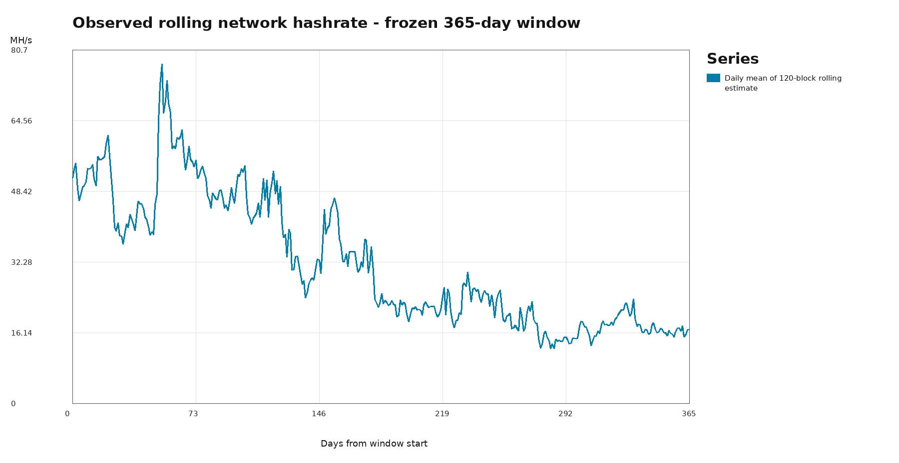

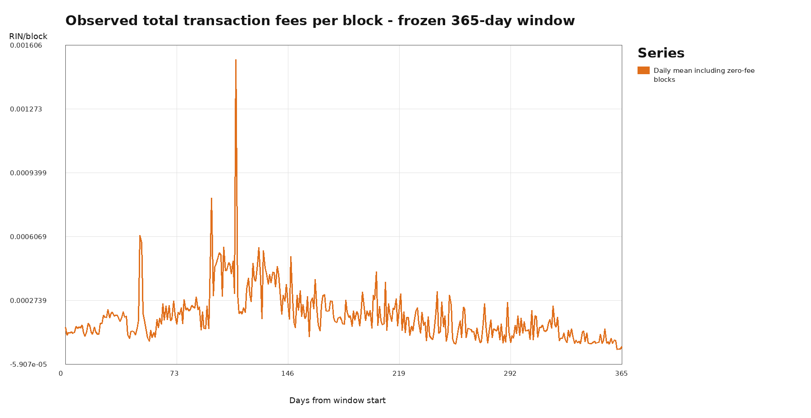

## Historical Price, Volume and Halving Events

CoinPaprika's free API returned 333 RIN daily historical ticks between
2025-07-28 and 2026-07-27. It rejected the longer request with HTTP 402; that
response is frozen with the successful dataset. Missing dates are not
interpolated. BTC/USD ticks from the same API are used only to derive RIN/BTC
where both daily observations exist [@rincoinEvidence2026market].



The values are historical daily ticks, not asserted exchange closes. Reported volume is mostly thin, and the historical feed does not include venue-level spread, depth or trade count.



None of the halving-price windows qualifies as high or medium confidence.

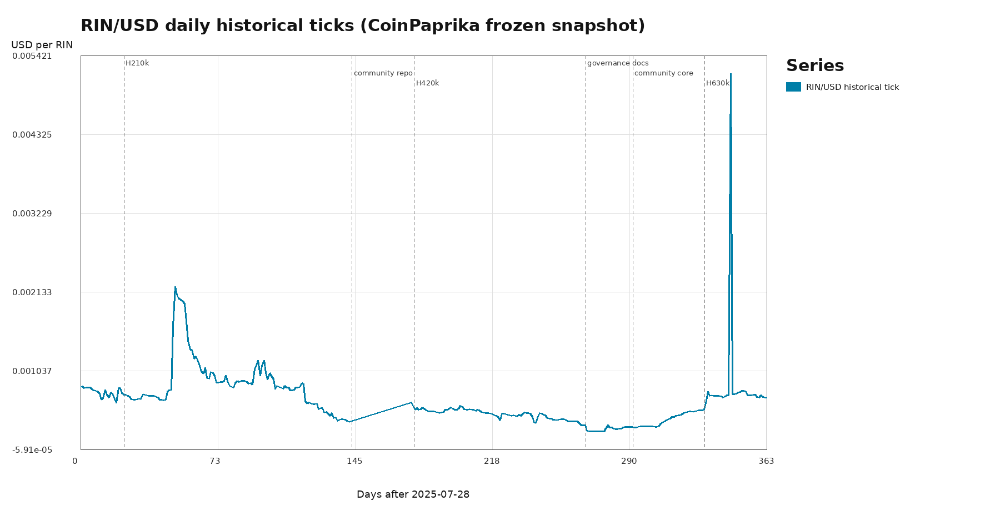

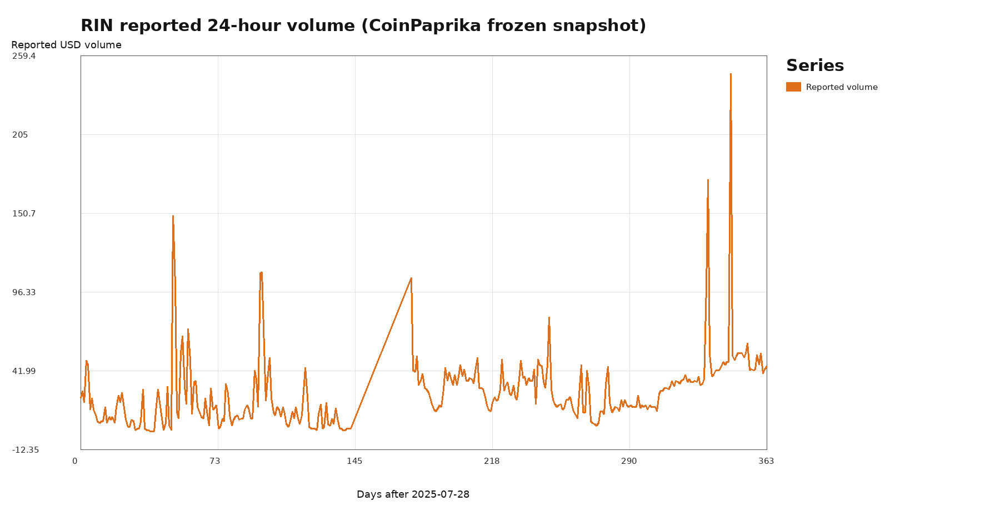

Exact main-chain halving times were read from the synchronised node rather than estimated from the 60-second target:



A binary halving requires price to double merely to preserve nominal subsidy revenue, with fees and costs held constant. The observed seven-day price windows were:



At block 210,000, RIN/USD fell over the one- and seven-day symmetric windows; the 30-day pre-event anchor is unavailable. At block 420,000, only the one-day window has complete anchors because CoinPaprika's RIN series has a material gap. At block 630,000, the one- and seven-day symmetric gains remained below the required 100%. The 30-day symmetric gain exceeded 100%, but most of that movement occurred before the boundary, reported volume was thin, and overlapping market and project events make attribution impossible.

The corresponding 30-day chain windows show:



Median rolling hashrate decreased after all three boundaries, by approximately 20.4%, 38.3% and 9.8% respectively. Median observed header-time intervals were broadly stable across the windows, consistent with difficulty response and continued block production. These descriptive changes do not isolate subsidy elasticity. The first event overlaps an operator-reported exchange interruption; the second lacks sufficient price coverage; the third occurs in a thin, changing market. `data/halving_price_hashrate_event_study.csv` therefore leaves precise RinHash reward-elasticity estimates blank rather than presenting unstable ratios as empirical parameters.

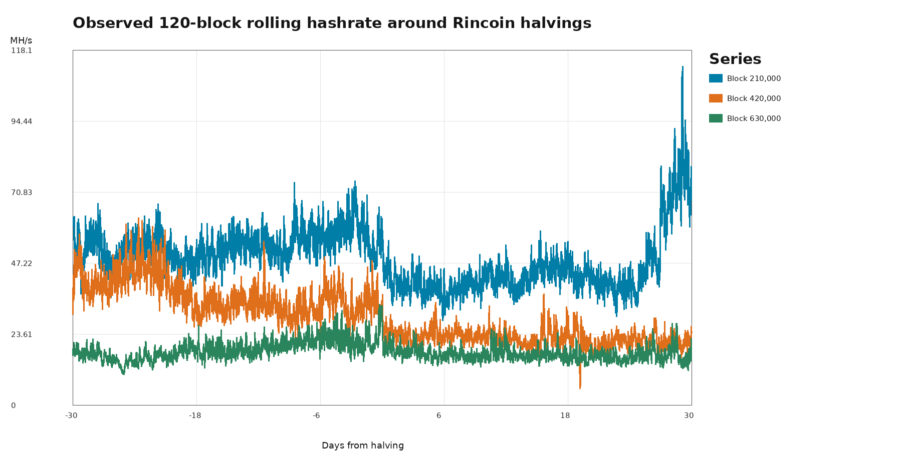

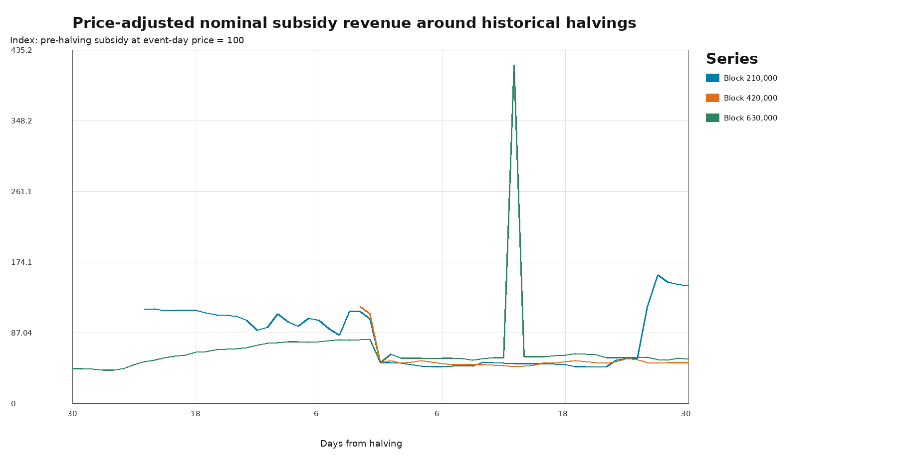

## Market-Event Timeline and Confidence Controls

`data/market_event_timeline.csv` separates exact chain and GitHub dates from
operator-supplied venue history. It records the Exbitron listing, reported
interruption and eventual RIN-market closure, the shift toward NestEx, the three
halvings, governance-document publication, and public Community Core work.
These are neutral event markers. Price movements overlap several events, but
low volume, missing venue histories and simultaneous changes prevent causal
attribution; price is not treated as a vote by network participants
[@rincoinEvidence2026market; @rincoinOperator2026evidence].



CoinPaprika's frozen current market list attributes all reported 24-hour RIN volume to NestEx. Its Gleec Wallet RIN/KMD and RIN/LTC rows reported zero volume, so no AtomicDEX volume is assumed or double counted. Rabid Rabbit remains a separate observation. A public historical order-book series was not available, so old displayed prices cannot be certified as executable.

## RinHash Rental-Market Exposure





The network-aligned Mining Rig Rentals snapshot contained 22 available, API-online listings advertising 10.3463 MH/s. It was captured with the 19.70723840 MH/s node estimate and is therefore used for the internally aligned rental-to-network ratios. A second snapshot about four hours later contained 14 available listings advertising 6.6583 MH/s. This within-day change demonstrates that visible rental depth is volatile; the aligned value is a dated analytical baseline, not a persistent capacity estimate. Mixing the later rental snapshot with the earlier node estimate would create a false point-in-time comparison.

Both listing sets, their endpoint metadata, and their response hashes are
preserved in the frozen evidence snapshots
[@rincoinEvidence2026network; @rincoinEvidence2026market].

The listings' five-minute delivered rate was zero at the aligned capture time; several listings state that they start mining when rented. Advertised capacity therefore cannot be treated as proven delivered hashrate.

The market page reported zero rentals and zero unique renters in the preceding 30 days. Quoted asks are consequently not observed market-clearing prices. The capacity-weighted ask was 0.000034110864 BTC/MH/day. Cost calculations use the full visible ask curve rather than applying the cheapest ask to all capacity.

### Listing-level rental-cost audit

\scriptsize

\normalsize

The listing ask is quoted in BTC per MH per day. Each listing's minimum
contractual price is therefore:

$$
C_{\min,i}=H_iP_i\frac{T_{\min,i}}{24},
$$

where $H_i$ is advertised MH/s, $P_i$ is BTC/MH/day, and
$T_{\mathrm{min},i}$ is the minimum rental duration in hours.



The sum of listing minimum contract prices differs from the weighted 24-hour
price because they answer different questions. The 24-hour value prices every
listed rig for a full day. The contractual minimum prices each rig only for its
own minimum duration: 16 of the 22 listings allowed less than 24 hours, five
required 24 hours, and one required 29 hours. The reconciled minimum all-capacity
ask is therefore 0.000090932105 BTC, while a full 24-hour rental of all capacity
is 0.000352921232 BTC. Both are quoted asks; neither establishes delivered
hashrate or an executed market price.



The theoretical 6-, 24- and 144-block costs prorate asks over 0.1, 0.4 and
2.4 target hours. Actual contracts are constrained by each listing's minimum,
so all three short analytical horizons have the same minimum contractual
all-capacity ask of approximately 0.000090932105 BTC, or 5.91 USD at the frozen
Kraken XBT/USD price. This remains an ask-based contractual estimate, not total
attack cost.

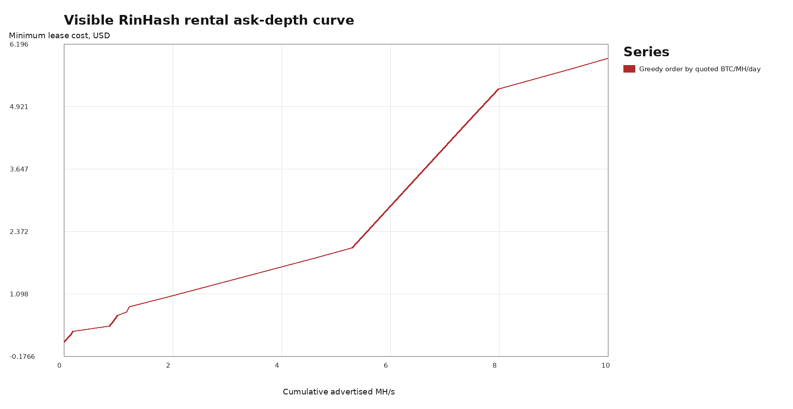

A controlled rental validation would be useful but is outside this passive snapshot. It should direct a small legitimate rental to an ordinary mining or test pool, without withholding blocks or attempting a reorganisation, and record setup delay, delivered hashrate, accepted/rejected/stale shares, xnonce behaviour and pool compatibility. Results should be published separately from the quoted market snapshot.

## Miner Hardware Economics



No sufficient independently reproducible RinHash dataset was found that combines hardware identity, miner version, measured hashrate and wall power. MRR rig names and advertised hashrates do not supply wall-power measurements and are not independent benchmarks. `data/hardware_benchmark_protocol.csv` therefore specifies a reproducible measurement procedure rather than presenting placeholder CPU, GPU or FPGA classes as empirical evidence.

Until measurements exist, hashprice, electricity break-even, hash per watt and hardware acquisition economics cannot be reported as observed RinHash values. The normalized hardware classes used later are dimensionless sensitivities only.

## Reward-Boundary Shocks and Price Compensation
\scriptsize

\normalsize

Three distinct risks must not be collapsed into one term:

1. **Immediate miner-revenue shock** is the subsidy reduction at height
   840,000, holding fees and price constant.
2. **Consensus activation divergence** begins at height 840,000 for every
   proposed rule because candidate and legacy nodes permit different maximum
   coinbase values.
3. **First later scheduled reward shock** is the first subsidy reduction after
   activation.

S0 and S5/a impose a 50% immediate miner-revenue shock and require a 100% price
increase for price-only compensation. S1 imposes a 5% immediate shock, creates
consensus divergence at height 840,000, and continues with 5% reductions each
epoch; price-only compensation for each ideal reduction is approximately
5.263%. S5/b also creates consensus divergence at height 840,000 because legacy
software permits only 3.125 RIN while S5/b permits 6.25 RIN. It has **no
immediate miner-revenue shock**, but its first later scheduled reward shock is
50% at height 2,730,000. S4 begins with a 0.877% cut and requires approximately
0.885% growth. S6 and S7 begin with a 36% cut from 6.25 to 4 RIN and require
56.25% price growth.

Ordinary reduction rates and terminal integer effects are also reported
separately. A percentage calculated from a few remaining base units is not
economically comparable to a 50% reduction from several RIN:

\scriptsize

\normalsize

A later fixed phase or tail emission cannot prevent miner exit caused by an earlier activation shock. It can only affect incentives once that later phase begins. The full deterministic file `data/price_compensation.csv` computes the price-only threshold for every reward boundary; it does not assume that scarcity produces the required price response.

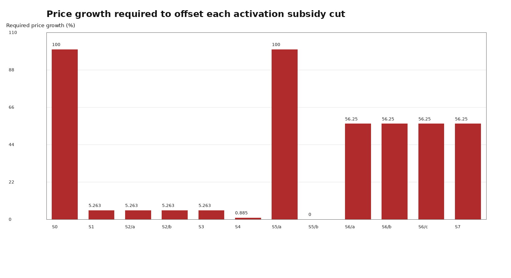

Dark Gravity Wave v3 adjusts difficulty after block-timing changes. It does not restore revenue lost at a subsidy boundary. Miner exit can therefore produce slow blocks or concentration before difficulty adapts.

## Fee-Market Replacement Requirements

The empirical fee cases use the frozen 90-day distribution. Because 95.14% of blocks had no non-coinbase transaction, the all-block p10, median and p90 fees were all zero. The low case therefore uses the all-block median of zero; the base case uses the all-block mean of 10,002.55 base units, rounded to 10,003; and the high case uses the p90 of 290,698 base units conditional on transaction-bearing blocks. That conditional high case must not be read as an all-block p90.



At activation, replacing a 5% S1/S2/S3 boundary would require an additional
0.3125 RIN per block, about 3,124 times the observed 90-day all-block mean fee
and about 313 transactions at the observed median fee per transaction.
Replacing the S0/S5/a 50% boundary would require 3.125 RIN per block, about
31,242 times the mean and 3,126 median-fee transactions per block. S5/b requires
no fee replacement at activation, but its first halving at height 2,730,000
creates the same 3.125 RIN-per-block gap if fees and subsidy remain otherwise
unchanged. Even S4's smaller first reduction would require roughly 548 times the
observed mean fee.

These ratios show that fee replacement for every non-zero modelled immediate
subsidy shock is not remotely supported by current usage. S5/b requires no fee
replacement at activation, but would face a later 3.125 RIN-per-block subsidy
gap at height 2,730,000 under unchanged fees and price. These results do not
predict future demand, fee policy or price. The full file includes fee share
before and after every boundary, both with unchanged observed fees and with
complete hypothetical fee replacement.

### Transaction value is not transaction byte size

The frozen dataset contains serialization and input/output counts for the same
68,946 transactions used for exact fee reconstruction. The earlier scatter
plot has been removed: it connected a one-in-twenty sample as a line, mixed
different transaction structures, compressed dense observations and extreme
outliers, and did not communicate a defensible relationship.

Specifically, the removed graphic placed `log10(aggregate output RIN)` on a
linear x-axis and serialized bytes on a linear y-axis. Aggregate outputs
included possible change. A dense 222-byte cluster, 1,392 transactions over
10,000 bytes, 19 over 100,000 bytes, and a 217,303-byte maximum made the sampled
connected trace visually uninformative. Its caption did not explain the
one-in-twenty sampling or structural mixture. The intended question is instead
whether transferred economic value determines serialized size; the available
data support a structural comparison, not that causal claim.

The most common exact input/output structures show why structure must be
considered explicitly:



For example, the 39,366 observed one-input/two-output transactions have a
median serialized size of 222 bytes and a p10-p90 range of 222-222 bytes even
though their aggregate output values vary. Across the complete dataset, the
descriptive associations are:



The strong association between input-plus-output count and serialized size is
a structural diagnostic, not a causal estimate; script types, witness data and
metadata also affect serialization. Conversely, the weak negative association
between aggregate output value and size does not show that higher-value
transactions are smaller. It reflects a mixed, non-random set of transaction
structures and activity.

Aggregate output value includes possible change and is not a payment-value
estimate. The observation interval is known to contain maintainer test
transactions. The frozen evidence does not provide approved address or time
labels with which to remove them, so they remain in the calculations and
confound economic-value interpretation. They do not alter the mechanical fact
that serialized size is determined by transaction structure and encoding, not
by the number of RIN transferred. The binned results are preserved in
`data/transaction_size_by_value_range.csv`; no causality is inferred from any
correlation.

## Price and Liquidity Sensitivity
\scriptsize

\normalsize

NestEx and Rabid Rabbit are retained as separate observations because their prices, spreads and available metadata differ materially. At NestEx, visible bids within 5% totalled about 18,440.9 RIN. Walking the scheduled 9,000 RIN daily subsidy through the frozen bids completed at an average 0.000644281769 USDT/RIN, 0.667% below the best bid. Scheduled daily issuance was 12.88% of NestEx's reported 24-hour RIN volume. This is one static order-book walk, not an estimate of recurring daily impact.

Rabid Rabbit showed a much wider spread and did not expose compatible 24-hour volume through the frozen endpoint. Its values are therefore not merged with NestEx. Exchange depth can change faster than block-level monetary data, and displayed orders may be cancelled or may not represent executable capacity.

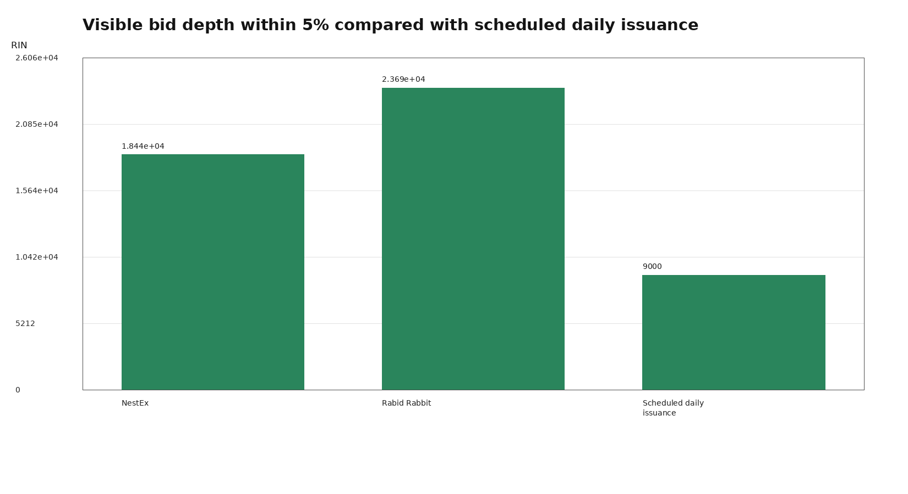

### NestEx liquidity pool
\scriptsize

\normalsize

The operator-supplied screenshot labels its base quantity `Pooled NEX` but there should be RIN. This was a flaw which was reported and fixed by the NestEx staff immediately. A separately frozen public RIN endpoint collected the same day explicitly labels a near-identical quantity `Pooled RIN`. This supports an interpretation that the earlier interface label was inconsistent, but the source record is not silently rewritten.

NestEx describes the facility as an exchange-managed automated liquidity reserve integrated with its centralised order book. The analysis therefore measures executable depth from the order book and does not apply a generic constant-product slippage formula. Total displayed LP capital is not equivalent to executable bid depth within 5%.

The public endpoint reported three providers. The largest position was 84.52%, HHI was approximately 0.7300, and the effective provider count was about 1.37. The identity of the largest provider as Rincoin Community is operator-supplied, not independently verified.

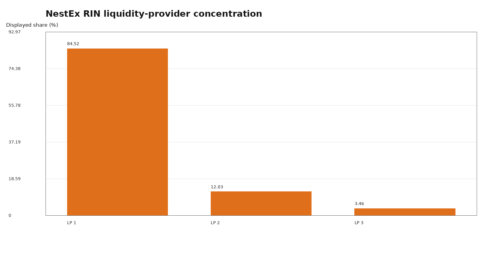

Sixty rate-limited public tradebook pages provide a frozen executed-trade history in `data/nestex_trade_history.csv`. The repeated order-book/LP collector begins with one dated observation; it does not yet constitute a 14- or 30-day depth series.

## Sticky and Price-Elastic Hashrate

The homogeneous exit model is replaced by:

$$
H_{\mathrm{honest}} = H_{\mathrm{committed}} +
H_{\mathrm{elastic}}(1-e),
$$

where \(e\) is applied only to elastic hash. The frozen network estimate is 19.70723840 MH/s. At least 4 MH/s, or approximately 20.3%, is reported by the operator as Rincoin Community infrastructure and is not listed on Mining Rig Rentals. It is described as **operator-committed under current policy**, not permanently price-independent.
This 4 MH/s value is operator-supplied rather than independently verified
[@rincoinOperator2026evidence].



With 4 MH/s committed and no attacker-owned hash, visible rental capacity does not exceed remaining honest hash through the 50% elastic-exit case. It exceeds remaining honest hash in the 75% case. Without committed hash, visible rental capacity exceeds the modelled honest network after a 50% elastic exit. `data/sticky_elastic_hashrate_scenarios.csv` includes committed-hash cases of 0, 2 and 4 MH/s, elastic exits of 0%, 10%, 25%, 50% and 75%, and configurable attacker-owned hash of 0, 2, 5 and 10 MH/s.

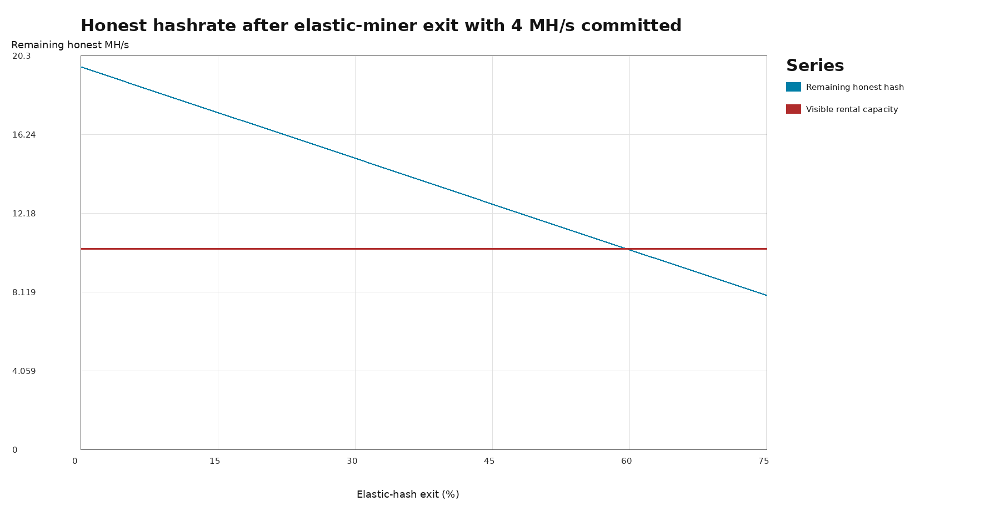

Committed infrastructure improves downside resilience, but it also creates
dependency. The same operator is reported to supply approximately 4 MH/s, about
85% of displayed NestEx LP value, Fulcrum and other services. Resources
controlled by one operator are not counted as independent redundancy.
`data/cross_layer_operator_concentration.csv` separates the resilience
contribution from this concentration risk [@rincoinOperator2026evidence].

## Attack-Capacity and Reorganisation-Risk Proxies



The additive zero-overlap case assumes none of the visible MRR capacity is
already contributing to the observed network. Under that assumption, visible
rental capacity equalled 52.5% of pre-existing honest hashrate but 34.43% of
combined honest-plus-rental hashrate, and did not exceed the observed honest
network. That conclusion must not be generalized to unknown overlap.

Let \(\alpha\) be the fraction of visible rental capacity already contributing
to observed network hashrate. Redirecting rented capacity then removes
\(\alpha H_r\) from the honest chain while adding the full \(H_r\) to the
attacker chain. The operator-supplied 4 MH/s Community Forge component is not
listed on MRR and remains outside this overlap.



At 100% overlap, the visible rental capacity exceeds the remaining honest
hashrate in this static model. The overlap is not observed, so the table is a
speculative stress range rather than an estimate of actual attacker control.
It corrects the stronger additive-only statement: visible rental capacity is
insufficient only in the zero-overlap case and the lower modelled overlap cases.

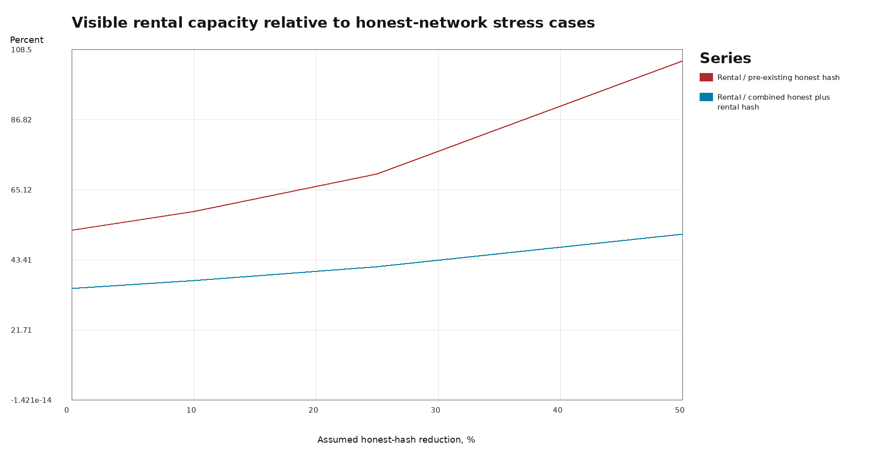

`data/rental_attack_capacity.csv` walks the quoted ask curve and respects each
rig's minimum rental duration. The sticky/elastic file combines the same visible
rental capacity with configurable owned hash. Both report whether visible depth
is sufficient rather than extrapolating beyond listed rigs.

Rental expense is not total attack cost. The analysis does not observe private hashrate, delivered rental reliability, setup delay, pool rejection, detection and countermeasures, exchange confirmation changes, reorganisation success probability, double-spend liquidity or price collapse. The observed explorer orphans were depth 1; this does not establish a safe confirmation count or bound deeper adversarial reorganisations.

### Confirmation policies and mathematical catch-up proxy

The following service settings are operator-supplied evidence. They describe
different contexts and are not interchangeable security standards
[@rincoinOperator2026evidence].



AtomicDEX's two-confirmation value is an atomic-swap protocol setting, not a
custodial exchange deposit policy. Rincoin Core and Electrin values describe
wallet-display conventions; NestEx's value is a custodial deposit policy.

For comparison only, the next table applies the elementary biased-random-walk
eventual catch-up expression \(1\) for attacker fraction \(q\geq 0.5\), and
\((q/(1-q))^z\) otherwise, at confirmation depth \(z\). It uses each overlap
case's static attacker share from the preceding table.



These are mathematical proxies, not empirical reorganisation probabilities.
They omit finite attack duration, difficulty changes, block-time variance,
network propagation, detection, service response, rental delivery, and attacker
economics. Their purpose is to show why confirmation depth and rental overlap
must be analysed together, not to certify any confirmation policy as safe.

## Scenario Security Comparison



This table combines deterministic activation subsidies with the frozen 90-day mean fee and NestEx marginal price. Price and fees are held constant solely to expose the boundary arithmetic; the resulting USDT values are not forecasts for block height 840,000. The final column remains a normalized sensitivity under a different common-assumption model.

S0 and S5/a have the largest immediate nominal revenue reduction. S6 and S7
are intermediate, S1/S2/S3 are smaller, S4 is smallest, and S5/b has no subsidy
change at the activation boundary. S5/b consequently preserves the highest
activation subsidy among the bounded corrective candidates, but its first
delayed boundary is still a 50% cut. At later horizons, fixed or perpetual
phases maintain more nominal subsidy than finite declining schedules, but their
issuance trade-offs remain those reported in the deterministic analysis. A
larger subsidy supports a larger gross revenue figure under equal price and
fees; it does not establish realised security without hardware, liquidity and
miner-response evidence.

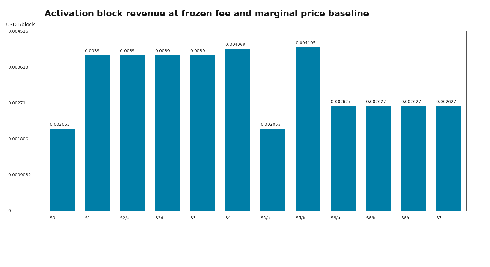

The empirical overlay does not change the monetary score and does not produce a
synthetic total. It distinguishes immediate miner-revenue shock, consensus
activation divergence, first later scheduled reward shock, subsidy runway, and
eventual fee dependence. A fixed phase can improve later nominal revenue but
does not repair a severe earlier miner-revenue shock. No scenario has evidence
that current fees could replace its immediate subsidy loss.

## External Research and Transfer Limits
\scriptsize

\normalsize

Primary research supports analysing reward elasticity, cross-chain allocation,
DAA feedback, fee-only incentives and attack economics
[@kawaguchi2026reward; @bissias2018allocation; @ilie2020unstable;
@carlsten2016instability; @easley2019fees; @budish2018limits;
@gervais2016security]. It does not supply RinHash calibration. Published BTC,
BCH or BSV elasticities are not transplanted to Rincoin because hardware
interchangeability, market depth, DAA rules and miner populations differ.

## Normalised Long-Run Sensitivities

The original normalised model is retained as a secondary scenario-analysis layer. It applies common stress, flat-price and moderate-growth price indices; empirically anchored fee cases; placeholder hardware-cost classes; and explicit liquidity-realisation factors. These are sensitivity controls, not observations or forecasts.
\scriptsize

\normalsize

The table uses the flat-price, observed-base-fee and normalised reference-hardware case. The complete Cartesian output is `data/miner_revenue_break_even.csv`. Its sustainable-hashrate index means revenue-supported normalised cost units; it is not hashes per second.

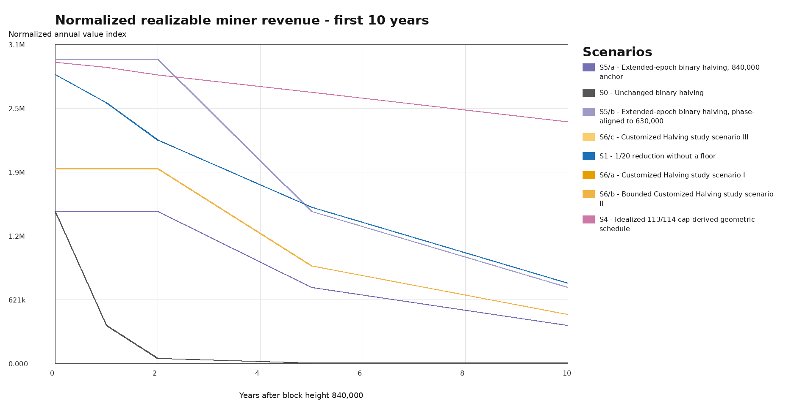

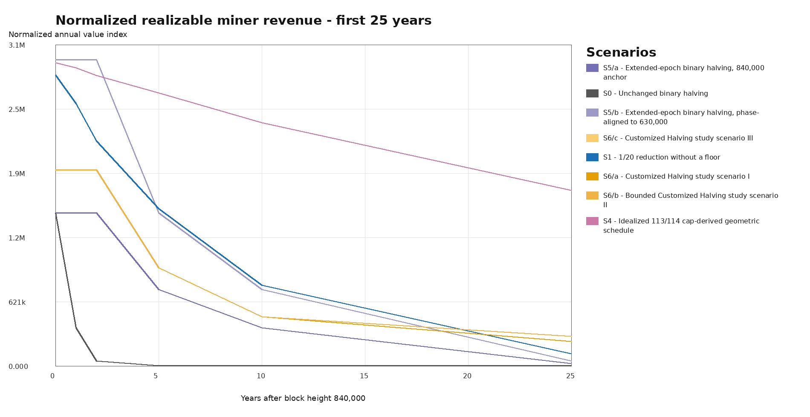

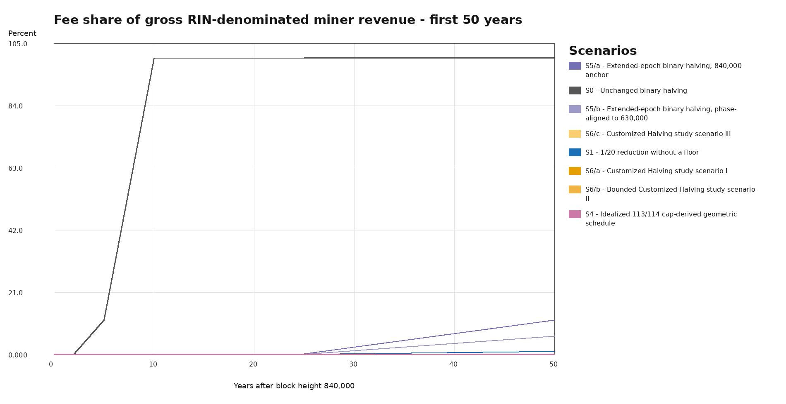

Long-run normalised price paths are not empirical forecasts and do not select
between the focused candidates. Multi-century price compounding is omitted
from the main interpretation because it creates false precision. The assumption
matrix and generic attack proxies are documented in the appendix.

## Limitations

The snapshot is dated. Point-in-time market depth can be withdrawn, quoted rental capacity has not been validated by an executed rental, and the repeated NestEx order-book/LP series has only one observation. CoinPaprika history starts in July 2025 and contains a material gap. Exbitron event dates remain partly operator-supplied. No measured RinHash power-efficiency dataset is available. Pool shares, private hashrate and hardware opportunity cost remain unobserved.

Observed price, fees, volume and hashrate do not define a stable equilibrium. Stress cases do not estimate probability. Rental asks do not establish delivered hashrate or market-clearing cost, and rental cost is not reorganisation cost. Exchange depth does not establish realisable double-spend value. DGWv3 behaviour around a future reward boundary still requires a chain-level transition simulation.

The robust findings are narrower:

1. no historical halving provides a high-confidence case that price promptly and durably doubled to offset the reward cut;
2. observed median hashrate fell in each 30-day post-halving window, but event confounding prevents a causal elasticity estimate;
3. current fee revenue is negligible relative to every non-zero modelled
   immediate subsidy shock; S5/b has no such shock at activation but has a later
   3.125 RIN-per-block subsidy gap at height 2,730,000 under unchanged fees and
   price;
4. operator-committed hash materially improves the downside stress case while introducing single-operator dependency;
5. visible rental asks are material relative to current hashrate; they do not
   exceed the observed honest network in the zero-overlap additive case, but
   exceed remaining honest hash in the 100%-overlap static case and in severe
   elastic-miner-exit cases;
6. a later fixed phase does not repair an earlier miner-revenue shock; and
7. current liquidity is thin and concentrated, so displayed price and volume cannot be treated as a stable security budget.

\newpage
# Conclusions and Public Review

## Preliminary Conclusion

The principal public-review set is **S1, S5/b and S6/b**. S1 and S5/b form a
controlled comparison pair: their ideal post-840,000 issuance is exactly equal.
Integer consensus
arithmetic produces maximum scheduled issuance of 44,624,993.01750000 RIN for
S1 and 44,624,999.76900000 RIN for S5/b, a difference of only 6.75150000 RIN.
The unresolved choice is therefore about the timing and shape of issuance,
not its final amount within that pair.

S1 is the stronger candidate if the principal objective is to eliminate large
scheduled reward cliffs and allow miner economics to adjust gradually. It
imposes a 5% immediate miner-revenue shock at height 840,000 and repeats 5%
reductions every 210,000 blocks. This provides continuous predictability and
limits each scheduled adjustment, but creates frequent monetary changes and no
rare consensus-level halving milestone.

S5/b is the stronger candidate if the principal objective is to avoid an
immediate subsidy reduction, restore a familiar four-year monetary rhythm, and
preserve major public halving milestones. For heights at and above activation,
its schedule is phase-aligned to height 630,000 without changing historical
validation. It keeps 6.25 RIN through height 2,729,999 and imposes its first
later 50% reduction at height 2,730,000. The approximately 3.60-year interval
offers preparation time, but current evidence does not show that fees or price
will absorb that future shock.

Both candidates create validation rules divergence at height 840,000. S1
permits 5.9375 RIN where legacy software permits 3.125 RIN; S5/b permits 6.25
RIN. S5/b therefore has no immediate miner-revenue shock, not an absence of
consensus activation risk.

S6/b is the bounded representative of Customized Halving Scenario II. It uses
4 RIN from activation, 2 RIN from height 2,100,000, 1 RIN from height
4,200,000, and 0.6 RIN from height 6,300,000 through 234,587,499. Its
precomputed zero-subsidy height is 234,587,500 and its maximum scheduled
issuance is exactly 168,000,000 RIN. It prioritizes continuity with that
published direction and a centuries-long nominal subsidy. Its trade-offs are a
36% activation reduction, later 50%, 50% and 40% reductions, a roughly
434-year final phase, missing source derivations, and a broader governance
contingency excluded from the fixed rule. The inspected S7 implementation is
unbounded and is not evidence that this cutoff is implemented.

The current numerical score does not resolve the choice. S1's higher raw score
depends partly on a ten-year scheduled-supply threshold that places S5/b just
over the 100% boundary. The score also excludes the possible communication and
coordination value, and possible volatility cost, of major halving milestones.
These omissions are deliberate because those effects are qualitative and not
established by the deterministic model.

S5/a remains a lower-issuance comparison but imposes a 50% immediate
miner-revenue shock. S0 remains the no-hard-fork baseline. S2 and S6 illustrate
the multi-century consequences of bounded constant phases, S4 is the
cap-derived geometric comparator, and S3 and S7 remain unbounded
security-budget comparators.

The unresolved policy question is:

> **Should Rincoin distribute the remaining issuance through smooth recurring**
> **reductions, through a familiar sequence of infrequent but highly visible**
> **halvings, or through the bounded 4 → 2 → 1 → 0.6 RIN Customized Halving**
> **interpretation?**

No candidate is preferred or adopted before public review.

## What Could Change the Principal Review Set

The principal review set and its interpretation should be reconsidered if:

1. network participants do not consider the fast binary-halving cadence a
   problem;
2. bounded issuance is not considered a required policy property;
3. credible evidence shows that four-year 50% reward shocks are reliably
   absorbed by price or miner economics;
4. implementation, arithmetic, or security defects are found in S1, S5/b or
   S6/b;
5. another bounded scenario performs better under the same published criteria;
   or
6. corrected source data materially change the current empirical conclusions;
   or
7. the authors or maintainers of Customized Halving materially clarify,
   revise, withdraw or supersede the S6/b direction.

## Questions for Public Review

1. Should Rincoin retain S0 or change the subsidy rule at height 840,000?
2. Should Rincoin eliminate all large scheduled reward cliffs through S1?
3. Should it retain four-year halving milestones through S5/b?
4. Should it use the bounded S6/b 4 → 2 → 1 → 0.6 RIN path and exact 168M
   maximum scheduled issuance?
5. Is S6/b's 36% activation reduction acceptable, and is its multi-century
   final phase useful or operationally too similar to tail emission?
6. Should the fixed S6/b rule remain separate from the broader governance
   contingency and the unbounded S7 implementation snapshot?
7. How much value should be assigned to the psychological, communication, and
   community-coordination role of halving events?
8. Is the approximately 3.6-year delay before S5/b's first future halving a
   sufficient opportunity for the market and mining ecosystem to mature?
9. Is S1's smoother but less eventful monetary path preferable?
10. Does any evidence support or contradict an expectation that halving
   milestones improve price, attention, or adoption?
11. Are all three candidate specifications and vector sets technically accurate?
12. Are any eligibility gates, criteria, sources, or calculations incorrect?
13. Should S5/a remain a secondary comparator or enter the principal set?
14. What evidence should change the principal review set?

Maintainers and authors of externally published proposals are specifically
invited to submit factual corrections. Where practical, distinguish factual 
corrections from policy preferences, but free-form feedback is welcome.

\newpage
# Implementation, Activation and Public Review

## Implementation and Activation Risks

Any post-840,000 subsidy change is a hard fork. It does not preserve consensus-code continuity after activation. It can preserve ledger continuity if all pre-activation blocks and UTXOs remain valid and only future subsidy validation changes.

Before activation, the project needs:

- final consensus-change specification;
- exact integer arithmetic and rounding rule;
- activation boundary tests;
- transition and off-by-one vectors;
- independent simulator or implementation cross-check;
- deployed-source citations for current consensus behaviour;
- reproducible review-implementation test artifacts;
- wallet, pool, explorer and exchange readiness;
- chain-identification and replay-risk decision;
- go/no-go checkpoint date and height before block 840,000.

If the final specification, implementation, normative test vectors, public review, reproducible releases, pool/exchange/wallet readiness and replay-risk decision are not complete by a defined checkpoint date and checkpoint height, activation at block height 840,000 should be deferred.

Public review should be based on a reproducible package rather than on the PDF
alone. The package should include this report, all three candidate whitepapers,
all three candidate specifications, Quarto sources, machine-readable scenario
configuration, simulation code, all three vector sets, generated data, checksums,
immutable source references, public and private feedback routes, and explicit
conditions that could change the principal review set.

### Chain Identification, Peer Separation and Replay Protection

Changing the subsidy rule changes block validity after activation, but it does not automatically solve transaction replay or service confusion. A block-version marker can identify block-validation semantics if it is explicitly enforced, but it does not by itself prevent the same signed transaction from being valid on two branches that share transaction formats and signature rules.

The replay and service-confusion analysis must cover P2P protocol version, user-agent strings, network magic, default ports, block validation rules, checkpoints, transaction serialization, signature hashing, address formats, wallet chain selection, SPV server selection, exchange routing, explorer labeling and one-sided versus two-sided replay protection.

No final replay-protection mechanism is prescribed here. It requires source-level analysis and a separate technical design.

## Risk Register

\scriptsize
| Risk | Affected scenarios | Consequence | Mitigation required |
|---|---|---|---|
| Off-by-one activation bug | All hard-fork scenarios | Invalid chain split at block height 840,000 | Boundary vectors, regression tests and independent implementation review |
| Rounding mismatch | S1, S2, S4, both S5 variants, S6 and S7 | Different nodes calculate different subsidy | Integer-only specification and normative vectors |
| Treating the documented 168M maximum as a required target | S2, S4 and S6 | Multi-century issuance or coefficient choice without explicit policy | Decide whether it is a ceiling, target, or documentation-versus-consensus inconsistency |
| Unbounded issuance | S3 and S7 | No fixed maximum scheduled issuance | Explicitly decide whether tail emission is acceptable |
| Replay or service confusion | All hard-fork scenarios | User, wallet and exchange loss | Separate chain-identification and replay analysis |
| Weak source citations | All scenarios | Publication cannot be independently verified | Immutable source references before final release |
| Mining-security overclaim | All scenarios | Misleading security expectations | Keep subsidy analysis separate from price/hashrate forecasts |
| Dated or incomplete empirical evidence | All scenarios | Point-in-time rental, liquidity or orphan-index data may be overgeneralized | Publish retrieval times and hashes; refresh through a separately reviewed evidence snapshot |
| Unverified rental delivery and hardware efficiency | All scenarios | Ask capacity or normalized cost may be mistaken for executable attack capacity | Controlled benign rental test and reproducible RinHash hardware benchmarks |
: {tbl-colwidths="[20, 24, 27, 29]"}

\normalsize

\newpage
\blandscape

## Normalized Sensitivity Appendix

\scriptsize

\normalsize

The price paths, liquidity realization, placeholder hardware costs and miner-response elasticities are normalized sensitivities. The fee rows are anchored to the frozen 90-day chain distribution, but the long-run model holds or changes them only as configured. `data/miner_revenue_break_even.csv` and `data/sustainable_hashrate_index.csv` contain the full Cartesian output.

`data/attack_cost_proxies.csv` retains the earlier generic 10%, 25% and 50% redirected-hash shares as secondary stress cases. The empirical rental model in `data/rental_attack_capacity.csv` is primary because it uses visible market depth and current network hashrate. Neither dataset is a complete attack-cost model.

\newpage
## Generated Artifacts

| Artifact | Purpose |
|---|---|
| `data/scenario_config.json` | Machine-readable source of truth for simulation parameters |
| `scripts/simulate_monetary_scenarios.py` | Scenario generator, assertions, figure writer and include-fragment writer |
| `scripts/collect_empirical_snapshot.py` | Collector that produced the reused 365-day base chain snapshot |
| `scripts/collect_transaction_fees.py` | Exact prevout-minus-output fee collector with per-block cross-checks |
| `scripts/collect_orphan_evidence.py` | Paginated collector for the explorer orphan index |
| `scripts/collect_market_evidence.py` | Separate live collector for price, exchange, rental, event and supplemental chain evidence |
| `scripts/collect_transaction_metrics.py` | Adds transaction serialization metrics while preserving the exact fee reconstruction |
| `scripts/collect_exchange_observation.py` | Append-only daily collector for the planned 14-30 day exchange observation series |
| `scripts/analyze_empirical_snapshot.py` | Offline empirical analyzer; performs no live API calls |
| `scripts/analyze_market_evidence.py` | Offline market, halving-event and miner-behaviour analyzer |
| `evidence/network-and-security-snapshot-20260727T121555Z/` | Frozen 365-day node, explorer, rental and exchange evidence |
| `evidence/market-and-chain-snapshot-20260727T163500Z/` | Frozen daily price, market, timeline, halving and transaction-metric evidence |
| `data/empirical_source_manifest.csv` | Source URLs, retrieval times and frozen-response hashes |
| `data/market_source_manifest.csv` | Frozen market-extension source URLs, retrieval times and response hashes |
| `data/empirical_network_snapshot.csv` | Timestamped current-network snapshot |
| `data/historical_network_baseline.csv` | 30-, 90- and 365-day network, transaction, fee and indexed-orphan statistics |
| `data/hashrate_history.csv.gz` | Per-block difficulty and 120-block rolling hashrate history |
| `data/fee_per_block_history.csv.gz` | Per-block subsidy, total fees, transaction count and fee share |
| `data/orphan_history.csv` | Frozen explorer-indexed orphan records |
| `data/rental_market_listings.csv` | Every visible RinHash rental listing and ask |
| `data/rental_cost_reconciliation.csv` | Listing-level ask units, duration minima and reconciled all-capacity prices |
| `data/rental_snapshot_comparison.csv` | Timestamped comparison of the network-aligned and later same-day RinHash rental snapshots |
| `data/rental_cost_curve.csv` | Capacity-weighted ask curve and contractual minimum costs |
| `data/rental_attack_capacity.csv` | Observed-rental capacity against honest-hash and owned-hash stress cases |
| `data/rental_overlap_model.csv` | Rental-redirection cases for overlap fractions from 0% through 100% |
| `data/rental_overlap_confirmation_proxies.csv` | Mathematical catch-up proxies by overlap case and confirmation depth |
| `data/service_confirmation_policies.csv` | Operator-supplied wallet, exchange and atomic-swap settings |
| `data/fee_replacement_calibrated.csv` | Boundary fee requirements calibrated to observed fee distributions |
| `data/exchange_liquidity.csv` | Venue-separated order-book depth and miner-sale-pressure calculations |
| `data/hardware_benchmarks.csv` | Explicitly pending empirical hardware dataset |
| `data/hardware_benchmark_protocol.csv` | Reproducible RinHash benchmark protocol |
| `data/empirical_scenario_security_comparison.csv` | Scenario comparison using the frozen baseline plus normalized reference values |
| `data/rin_daily_price_volume.csv` | CoinPaprika RIN/USD, derived RIN/BTC, volume, gaps and confidence flags |
| `data/exact_halving_events.csv` | Exact timestamps and subsidy transitions at blocks 210,000, 420,000 and 630,000 |
| `data/halving_price_event_windows.csv` | One-, seven-, 30- and 90-day price windows without interpolation |
| `data/halving_price_hashrate_event_study.csv` | Chain, fee, revenue and confidence metrics around each halving |
| `data/price_compensation.csv` | Required price-only compensation at every deterministic reward boundary |
| `data/market_event_timeline.csv` | Separately classified chain, project and operator-supplied market events |
| `data/nestex_lp_snapshot.json` | Public and operator-supplied NestEx LP snapshots with label distinction |
| `data/nestex_lp_concentration.csv` | Provider shares, HHI and effective-provider count |
| `data/nestex_trade_history.csv` | Frozen executed trades aggregated from 60 rate-limited pages |
| `data/sticky_elastic_hashrate_scenarios.csv` | Committed/elastic miner-exit and rental-plus-owned-hash stress cases |
| `data/transaction_value_size_summary.csv` | Economic-value, serialization, input/output and fee-rate distributions |
| `data/transaction_size_by_structure.csv` | Serialized-size distributions for the most common exact input/output structures |
| `data/transaction_size_by_value_range.csv` | Size and structure summaries by aggregate-output-value range, with value caveats |
| `data/transaction_size_relationships.csv` | Descriptive correlation diagnostics; no causal interpretation |
| `data/activation_terminal_shock_comparison.csv` | Activation shock, later shock, cadence and terminal regime by scenario |
| `data/pow_security_literature.csv` | Bounded primary-source literature review and transfer limits |
| `includes/*.qmd` | Generated QMD table fragments included by this document |
| `data/scenario_summary.csv` | Per-scenario deterministic summary |
| `data/horizon_table.csv` | Horizon outputs for all scenarios |
| `data/boundary_vectors.csv` | Boundary probes for transition tests |
| `data/S1_normative_test_vectors.csv` and `.json` | Candidate S1 normative vectors generated from the same scenario source |
| `data/S1_normative_test_vectors.sha256` | Hashes of the generated S1 vector files |
| `data/S5B_normative_test_vectors.csv` and `.json` | Candidate S5/b normative vectors generated from the same scenario source |
| `data/S5B_normative_test_vectors.sha256` | Hashes of the generated S5/b vector files |
| `data/S6B_normative_test_vectors.csv` and `.json` | Candidate S6/b boundary, cumulative-issuance and claim-validity vectors |
| `data/S6B_normative_test_vectors.sha256` | Hashes of the generated S6/b vector files |
| `data/S6B_independent_verification.json` | Results from the independent S6/b calculation that does not import the primary generator |
| `data/S1_S5B_candidate_comparison.csv` | Direct timing, cadence, issuance, and terminal comparison |
| `data/S1_S5B_equal_issuance.csv` | Ideal and integer equal-total-issuance derivation |
| `data/reward_shock_metrics.csv` | Normal scheduled reductions, economically relevant thresholds, and terminal effects |
| `data/s1_subsidy_half_life.csv` | Descriptive S1 mathematical half-life |
| `data/threshold_crossings.csv` | Below-threshold and zero-subsidy crossings |
| `data/scarcity_dilution_comparison.csv` | Direct scarcity and dilution comparison |
| `data/security_assumptions.csv` | Normalized economic assumptions and evidence status |
| `data/reward_boundary_shocks.csv` | Every post-activation subsidy boundary and nominal revenue shock |
| `data/fee_replacement_requirements.csv` | Fee increase required to offset each subsidy reduction |
| `data/miner_revenue_break_even.csv` | Miner-revenue and break-even sensitivity outputs |
| `data/sustainable_hashrate_index.csv` | Normalized revenue-supported hashrate-cost index |
| `data/attack_cost_proxies.csv` | Redirected-hash and owned-hardware attack-cost proxies |
| `data/security_comparison_by_horizon.csv` | Common-assumption scenario comparison |
| `scripts/simulate_security_economics.py` | Security-economics generator and consistency checks |
| `figures/*.png` | Generated long-horizon and near-term charts |
| `MANIFEST.sha256` | SHA-256 manifest for the current public-review package |

\newpage

# Source Notes and Evidence

\scriptsize
| Claim or statement | Classification | Current status | Required final evidence |
|---|---|---|---|
| RinHash construction is BLAKE3 -> Argon2d -> SHA3-256 | Original-whitepaper claim and deployed-source fact | Confirmed in the supplied PDF and deployed Core [@rincoinWhitepaper2025; @rincoinCore2026rinhash] | Immutable original-whitepaper archive remains pending |
| Target block interval is 60 seconds | Original-whitepaper claim and deployed-source fact | Confirmed in the supplied PDF and deployed chain parameters [@rincoinWhitepaper2025; @rincoinCore2026chainparams] | Complete |
| Initial subsidy is 50 RIN | Original-whitepaper claim and deployed-source fact | Confirmed in the supplied PDF and deployed subsidy function [@rincoinWhitepaper2025; @rincoinCore2026subsidy] | Boundary tests remain required for the candidate implementation |
| Original 168,000,000 RIN maximum-supply statement | Original-whitepaper claim; documentation/consensus mismatch | The supplied PDF states `Max supply: 168 million`; deployed binary-halving consensus approaches approximately 21,000,000 RIN; `MAX_MONEY` is a value-range constant and its source comment says it is not total money supply [@rincoinWhitepaper2025; @rincoinCore2026amount; @rincoinCore2026subsidy] | Immutable original-whitepaper archive remains pending |
| Deployed binary-halving schedule below 840,000 | Deployed consensus fact | Deployed Core uses binary right shift [@rincoinCore2026subsidy] | Independent boundary tests remain required |
| Transaction and block validation | Deployed source fact | The consolidated Core source entry identifies transaction structure, input/value and script checks, the coinbase subsidy-plus-fee limit, and cumulative-work selection [@rincoinCore2026deployed] | Complete for the cited snapshot |
| S1 effective maximum scheduled issuance | Simulation-derived result | Generated as 44,624,993.01750000 RIN | Final simulator hash and independent implementation vectors |
| S5/a effective maximum scheduled issuance | Simulation-derived result | Generated as 32,812,499.76900000 RIN | Final simulator hash and independent implementation vectors |
| S5/b effective maximum scheduled issuance | Simulation-derived result | Generated as 44,624,999.76900000 RIN | Final simulator hash and independent implementation vectors |
| Final spendable or circulating supply | Chain/economic outcome | Not equal to scheduled maximum by definition; may be lower | Chain data and accounting methodology if needed |
| Tokino Customized Halving scenarios | Public PDF study snapshot | Tokino v1.6.4, chapter 3, printed pages 10-16, defines three scenarios; this analysis models their Layer-1 subsidy paths and excludes annual loss-rate assumptions that are not consensus-enforceable [@tokino2026regenerative] | PDF SHA-256 `5269207ea7e363e8df312ed50c00afc119b43e6fa5d3c717e6a7d8fc9863147b` |
| Proof of Rinne | Separate long-horizon research architecture | Tokino v1.6.4 chapters 4-7 present a temporal-layer and asset-recirculation concept intended to preserve a security budget under a fixed macro cap. It is acknowledged as an interesting research direction, but it is not a present Layer-1 subsidy schedule and is not scored in this analysis [@tokino2026regenerative]. | Normative specification, implementable abandonment criterion, threat model, reference code, test vectors and adoption path |
| Aevust Core Customized Halving code snapshot | Source-code implementation snapshot | Aevust Core commit `f1591e4`, `src/validation.cpp` lines 1271-1290, implements a path corresponding to Tokino Scenario II phase rewards but returns 0.6 RIN indefinitely after height 6,300,000 unless another cap rule exists elsewhere; modelled as S7 [@aevustCore2026customized] | Complete for the inspected snapshot; later source changes require a new versioned scenario |
| Current network and 30/90/365-day history | Direct observation and chain-data derivation | Frozen local-node snapshot at height 674,074 plus 496,274 main-chain block records; response and output hashes recorded [@rincoinEvidence2026network] | Independent reproduction from another synchronized node |
| Transaction fees | Derived from observed chain data | 68,946 non-coinbase transaction fees reconstructed from prevouts; each block sum matched `getblockstats totalfee` [@rincoinEvidence2026network] | Independent parser cross-check |
| RinHash rental exposure | Directly observed ask market and derived cost curve | The network-aligned MRR snapshot exposed 22 available listings and 10.3463 MH/s; a later same-day snapshot exposed 14 listings and 6.6583 MH/s; no 30-day rentals were reported [@rincoinEvidence2026network; @rincoinEvidence2026market] | Controlled benign rental delivery test and repeated market observations |
| RinHash hardware efficiency | Empirical measurement | No sufficient reproducible hashrate-plus-wall-power dataset identified | Execute published benchmark protocol on representative hardware |
\normalsize

The supplied original RinCoin whitepaper is packaged as
`original/rincoin_whitepaper.pdf`, with SHA-256
`82ff8d10264b54828dabb28bf493cae42bcedcb0b036394de478d6772175dfb4`.
It was published at
[`https://coin.rin.so/rincoin_whitepaper.pdf`](https://coin.rin.so/rincoin_whitepaper.pdf).
The content hash fixes the inspected artifact, an independently maintained
copy is [in this repository](https://github.com/rincoin-community/consensus-840k/blob/71f4cd2fd2452cfc26852e76a77b18104ad0e527/analysis/original/rincoin_whitepaper.pdf). An immutable 
archive URL remains a publication TODO. The whitepaper is treated as
a historical document, not as current executable consensus
[@rincoinWhitepaper2025].

Deployed-behaviour evidence uses
[`Rin-coin/rincoin` commit `b52c87778f800dc5f4e2f59c372badbc139f933f`](https://github.com/Rin-coin/rincoin/tree/b52c87778f800dc5f4e2f59c372badbc139f933f).
[Chain parameters](https://github.com/Rin-coin/rincoin/blob/b52c87778f800dc5f4e2f59c372badbc139f933f/src/chainparams.cpp#L98-L114)
set the 210,000-block subsidy interval, 60-second target spacing, and DGW
activation.
[Subsidy validation](https://github.com/Rin-coin/rincoin/blob/b52c87778f800dc5f4e2f59c372badbc139f933f/src/validation.cpp#L1271-L1281)
uses binary right shift from `50 * COIN`.
[`COIN` and `MAX_MONEY`](https://github.com/Rin-coin/rincoin/blob/b52c87778f800dc5f4e2f59c372badbc139f933f/src/amount.h#L14-L25)
are defined in `amount.h`; the comment explicitly distinguishes `MAX_MONEY`
from total supply.
[Dark Gravity Wave](https://github.com/Rin-coin/rincoin/blob/b52c87778f800dc5f4e2f59c372badbc139f933f/src/pow.cpp#L18-L73)
and
[RinHash](https://github.com/Rin-coin/rincoin/blob/b52c87778f800dc5f4e2f59c372badbc139f933f/src/crypto/rinhash.cpp#L13-L50)
are cited at the inspected commit. RinHash uses Argon2d v1.3,
`t_cost = 2`, `m_cost = 64`, and `lanes = 1`
[@rincoinCore2026chainparams; @rincoinCore2026subsidy;
@rincoinCore2026amount; @rincoinCore2026dgw; @rincoinCore2026rinhash].

The base empirical security snapshot is frozen under `evidence/network-and-security-snapshot-20260727T121555Z/`. It contains local-node JSON-RPC results and 365 days of `getblockstats`/header history, exact per-transaction fee reconstruction, explorer summary and orphan-index responses, Mining Rig Rentals listings and market page, NestEx and Rabid Rabbit order books, and a Kraken XBT/USD conversion quote. The local node was fully synchronized at block height 674,074.

The frozen market extension is stored under
`evidence/market-and-chain-snapshot-20260727T163500Z/`. It contains CoinPaprika RIN and BTC
daily history and the HTTP 402 limitation response, current venue metadata,
NestEx order-book, liquidity and 60 tradebook pages, Mining Rig Rentals and
Rabid Rabbit snapshots, the explorer's `getlastorphans` response, exact
local-node halving blocks, supplemental pre-halving chain history, transaction
serialization metrics and frozen GitHub timeline records. Each
`SOURCE_MANIFEST.json` records source URL, UTC retrieval time, byte count and
SHA-256 hash. All public market values remain dated observations rather than
current facts at publication time
[@rincoinEvidence2026network; @rincoinEvidence2026market].

The externally published Customized Halving scenarios were read from
[Tokino Rincoin v1.6.4](https://zenodo.org/records/20674990/files/Tokino_Rincoin_v1.6.4.pdf),
chapter 3, printed pages 10-16, SHA-256
`5269207ea7e363e8df312ed50c00afc119b43e6fa5d3c717e6a7d8fc9863147b`.
This analysis treats the study as a source of scenario definitions and research
claims, not as deployed consensus [@tokino2026regenerative].

The same paper develops Proof of Rinne in later chapters as a separate long-horizon regenerative architecture. This report acknowledges that research direction but does not model or score it as a present Layer-1 monetary candidate. Its exclusion is a scope decision: the supplied material does not yet define a consensus-safe proof of permanent abandonment, complete adversarial ownership-recovery rules, deployed reference code, normative vectors or a block-840,000 activation path.

The Aevust implementation evidence is
[`Aevust/rincoin` commit `f1591e44277f6acb77d7b3d734da1cc884d05edb`](https://github.com/Aevust/rincoin/tree/f1591e44277f6acb77d7b3d734da1cc884d05edb),
dated 2026-05-23.
[`src/validation.cpp` lines 1271-1290](https://github.com/Aevust/rincoin/blob/f1591e44277f6acb77d7b3d734da1cc884d05edb/src/validation.cpp#L1271-L1290)
implement 4 RIN from height 840,000, 2 RIN from 2,100,000, 1 RIN from
4,200,000, and 0.6 RIN from 6,300,000 onward. The inspected subsidy function
does not itself stop issuance at 168 million RIN; unless another consensus rule
enforces a terminal height elsewhere, this snapshot is modelled separately as
S7, an unbounded implementation variant rather than the finite-to-cap S6/b
study scenario [@aevustCore2026customized].

\elandscape
\newpage
# References {.unnumbered}
